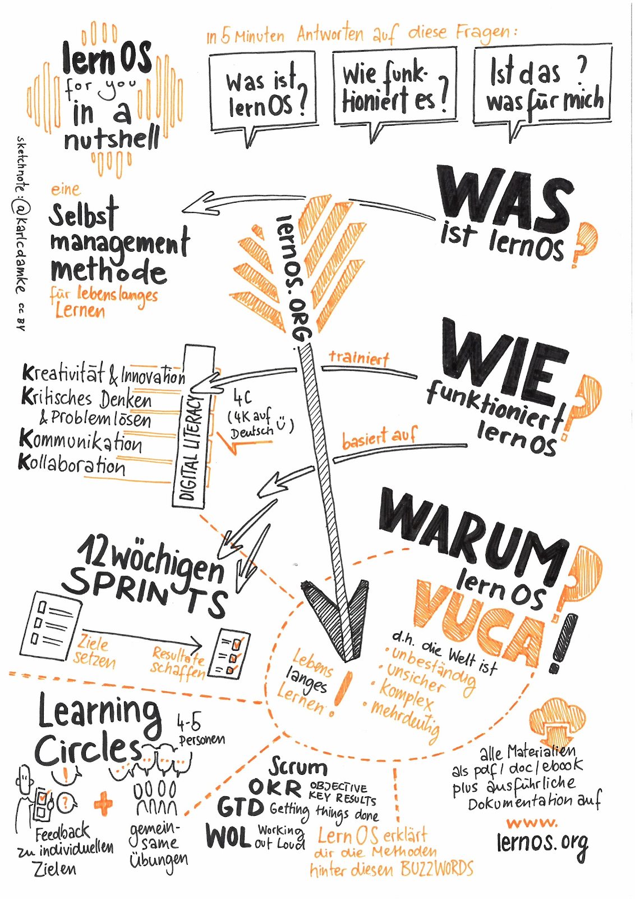
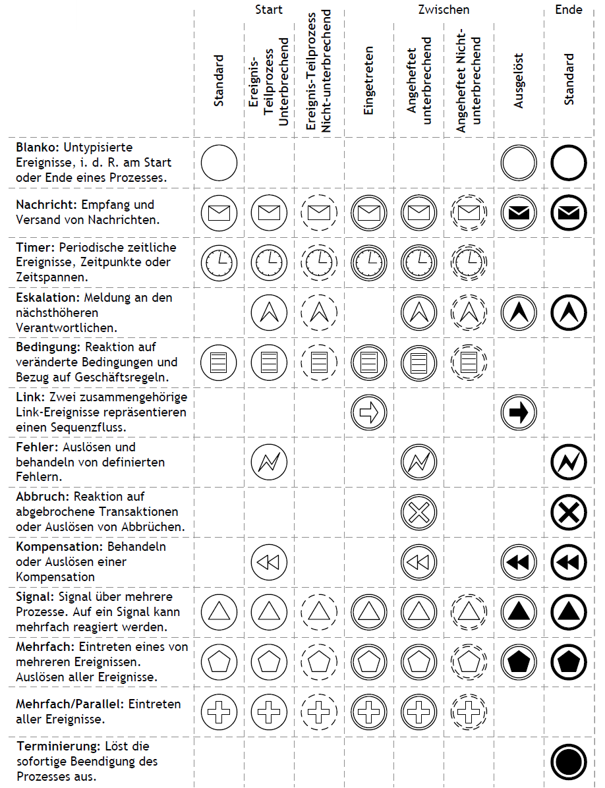
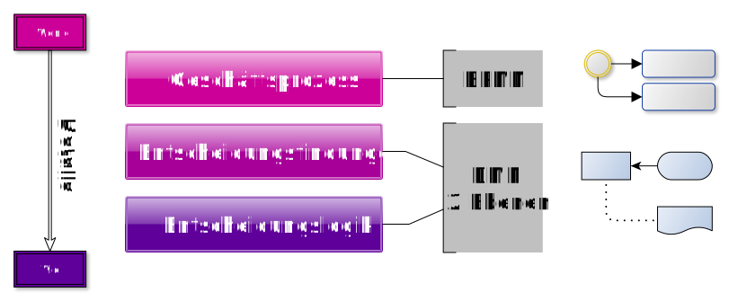
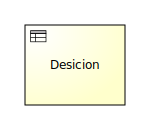

# Vorwort

Das Verb "lernos" ist die Zukunftsform von "lernen" auf Esperanto (mi lernos = ich werde lernen, ni lernos = wir werden lernen). **lernOS** ist ein **Betriebssystem** für **Lebenslanges Lernen** und **Lernende Organisationen**. lernOS ist aber keine Software, sondern "Brainware". Es ist eine Art zu Denken und zu Handeln, um als Einzelperson, Team oder Organisation im 21. Jahrhundert erfolgreich zu sein. Das groß geschriebene "OS" im Namen unterstreicht die Bedeutung der Digitalisierung für unsere vernetzte Wissensgesellschaft.

Zu lernOS gibt es **drei grundlegende Leitfäden**, die den Ansatz auf **individueller Ebene** (lernOS für Dich, [Präsentation](https://cogneon.github.io/lernos-for-you)), auf **Ebene von Teams** (lernOS für Teams) und auf **Ebene von Organisationen** (lernOS für Organisationen) beschreiben. Zusätzlich gibt es die **lernOS Toolbox**, die oft genutzte Methoden und Werkzeuge erklärt (z.B. Podcast, Barcamp, Sketchnoting, Expert Debriefing). lernOS ist nicht auf der sprichwörtlichen grünen Wiese entstanden, sondern ist eine Zusammenstellung von bereits bestehenden und bewährten Methoden. Alle lernOS Leitfäden sind unter der **offenen Lizenz Creative Commons Attribution (CC BY)** auf der [lernOS Webseite](https://cogneon.de/lernos) verfügbar und können gerne an die eigenen Bedürfnisse angepasst werden.

Wenn du **weitere Fragen** bezüglich lernOS hast, oder **Unterstützung von Gleichgesinnten** brauchst, kannst du die Community-Plattform [CONNECT](https://community.cogneon.de) und den [lernOS CircleFinder](https://community.cogneon.de/c/lernos/lernos-circlefinder) nutzen oder mit [#lernOS](https://twitter.com/search?q=%23lernOS) auf Twitter schreiben. Beachte: Die Meisterschaft von lernOS ist eine Frage von Monaten oder Jahren, nicht Stunden oder Tagen. Also: **Keep Calm & Learn On!**

Dein @locutusvonborg

# Danksagungen

lernOS ist von vielen Personen und Quellen inspiriert und steht daher [auf den Schultern von Riesen](https://de.wikipedia.org/wiki/Zwerge_auf_den_Schultern_von_Riesen). Einen Überblick über die Wurzeln und Inspirationen sind [im lernOS Wiki](https://github.com/cogneon/lernos-core/wiki) zusammengestellt. Für diesen Leitfaden möchte ich besonders danken:

- Simon Dückert für <FEHLT>
- Hans Facher für <FEHLT>
- Florian für <FEHLT>
- Ralf Schramm für <FEHLT>

**<u>*In wie weit müssen, sollen die im Core genannten in den Child-Lernpfaden genannt werden?</u>***

> - **Hirotaka Takeuchi** und **Ikujiro Nonaka** für die Einführung des Begriffs Scrum für agile Innovationsmethoden (1986).
> - **Jeff Sutherland** und **Ken Schwaber** für die Definition eines agilen Projektmanagements im [Scrum Guide](https://scrumguides.org) (2010).
> - **David Allen** für die Methode [Getting Things Done](https:/gettingthingsdone.com) (GTD), die den Weg zu stressfreier Produktivität von Wissensarbeiter*innen aufzeigt.
> - **Andy Grove** für die Entwicklung der Methode [Objectives & Key Results](https://de.wikipedia.org/wiki/Objectives_and_Key_Results) (OKR) als Weiterentwicklung des Management by Objectives (MbO) von Peter Drucker bei Intel (1980er). **John Doer** für die Einführung von OKR bei Google und **Rick Klau** von Google Ventures für seinen Vortrag [How Google sets goals: OKRs](https://www.youtube.com/watch?v=mJB83EZtAjc) (2013).
> - **Glyn Moody** (2006) und **Bryce Williams** (2010) für den Begriff und die Definition von Working Out Loud als "Observable Work + Narrating Your Work". **John Stepper** für die Gestaltung des 12-wöchigen WOL-Lernprogramms, das in den [WOL Circle Guides](https:/workingoutloud.com/circle-guides) dokumentiert ist (2015). **Katharina Krentz** von Bosch für ihre vielen Beiträge, Working Out Loud in Organisationen nutzbar zu machen.
> - **Johannes Müller** und **Tobias Müller-Zielke** für die Vorträge zu OKRs und GTD auf dem lernOS Rockstars Camp 2019 und **Alexander Rose** für die Zusammenstellung des GTD Lernpfads.

# Lizenz

lernOS Leitfäden stehen unter der Lizenz [Creative Commons Namensnennung 4.0 International](https://creativecommons.org/licenses/by/4.0/deed.de) (CC BY 4.0): 

**Du darfst:**

* **Teilen** - das Material in jedwedem Format oder Medium vervielfältigen und weiterverbreiten.
* **Bearbeiten** - das Material remixen, verändern und darauf aufbauen und zwar für beliebige Zwecke, sogar kommerziell.

**Unter folgenden Bedingungen:**

- **Namensnennung** - Du musst angemessene Urheber- und Rechteangaben machen, einen Link zur Lizenz beifügen und angeben, ob Änderungen vorgenommen wurden. Diese Angaben dürfen in jeder angemessenen Art und Weise gemacht werden, allerdings nicht so, dass der Eindruck entsteht, der Lizenzgeber unterstütze gerade Sie oder Ihre Nutzung besonders.
- **Keine weiteren Einschränkungen** - Du darst keine zusätzlichen Klauseln oder technische Verfahren einsetzen, die anderen rechtlich irgendetwas untersagen, was die Lizenz erlaubt.

# Einleitung

Um diesen Leitfaden bestmöglich nutzen zu können, solltest du etwas über lernOS wissen, auf dem dieser Leitfaden aufbaut. Dazu das Wichtigste in einer Sketchnote:

Wenn du mehr wissen willst, kannst alles über lernOS [auf Github](https://cogneon.github.io/lernos-core/) nachlesen, dort den Leitfaden herunterladen oder dir [diesen Podcast](https://colearn.de/clp066-aufzeichnung-cl-sprint-12-4-2019-die-kunst-des-selbstgesteuerten-lebenslangen-lernens/) mit Simon Dückert anhören. 

Im lernOS **Lernpfad Prozessmodellierung (BPMN&DMN)** werden wir an einigen Stellen auf bestimmte Inhalte aus dem lernOS Leitfaden oder weiterführende Ressourcen verweisen. 

## Warum ein Lernpfad Prozessmodellierung (BPMN&DMN)?

In der aktuellen [VUCA](https://de.wikipedia.org/wiki/VUCA)-Welt, in der die [digitale Transformation](https://de.wikipedia.org/wiki/Digitale_Transformation) und die damit verbundene Automatisierung von Arbeitsabläufen und Geschäftsprozessen in jede Branche  unaufhaltsam vordringt, wird die Kompetenz bestehende Geschäftsprozesse lesen und neue Geschäftsprozesse modeliieren zu können einen hohen Wert besitzen. In Kombination mit der Fertigkeit [Geschäftsregeln](https://de.wikipedia.org/wiki/Gesch%C3%A4ftsregel) verstehen und modellieren zu können, besitzt Du die optimalen Voraussetzungen als Bindeglied zwischen dem Business (Fachbereich) und der IT mit einer gemeinsamen verbindenden  Sprache (BPMN & DMN) die digitale Transformation nach vorne zu bringen.

Wie bei allem gilt auch beim Modellieren: **Übung macht den Meister!**

Dafür haben wir den **Prozessmodellierung (BPMN&DMN) Lernpfad** entwickelt. Er enthält unter anderem:

- 11 Katas (Übungen) zu den wichtigsten Bereichen der Prozessmodelierung
- Zahlreiche Ressourcen zur weiteren Vertiefung

# Lernpfad Prozessmodellierung (BPMN&DMN)

Wieso - weshalb & Warum

Alle Übungen sind so angelegt, das sie mit einem Stift und einem Blatt Papier zu lösen sind.  

## Woche 0: Organisation & Ziel(e) für die nächsten 12 Wochen

In Woche 0 gilt es einige administrative & organisatorische Festlegungen für die nächsten 12 Wochen zu treffen:

- **Wann** wird der wöchentliche Termin (Weekly) stattfinden? 

- **Wo** wird der wöchentliche Termin (Weekly) stattfinden? Persönliches Treffen oder virtuell?

- Welches **Ziel** willst Du in den nächsten 12 Wochen erreicht haben?

  - Verwende die Methode **[OKR](https://felipecastro.com/resource/The-Beginners-Guide-to-OKR.pdf)** um dein Ziel genauer zu beschreiben. 

  - Schreibe dein Ziel auf. Definiere **2-4 Schlüsselergebnisse pro Ziel**, um dir bei der Fortschrittkontrolle zu helfen. 

  - Du solltest die Schlüsselergebnisse auf einer **Skala von 0,0 - 1,0** messen können. Um sich ehrgeizige Ziele zu setzen, gilt eine Fertigstellungsrate von 0,7 als Erfolg.

    

    > *Ich will (Ziel):* ...
  >
    > *gemessen an (Schlüsselergebnisse):*
  >
    > 1. ...
    > 2. ...
    > 3. ...
    > 4. ...
  
  
  
- Welche **Tools** werden für die Kommunikation und Dokumentation verwendet? 

- **Wer** ist der Facilitator des Circles? Rollierend oder eine fester Person?

## Mach Dich mit den Grundlagen vertraut (Kata)

**In dieser Kata machst Du Dich mit den <u>wichtigsten Grundelementen</u> der Prozessmodellierung vertraut. Nimm Dir etwas Zeit für diese Übung, da Du viele neue Dinge lernen wirst. In dieser Kata geht es um das <u>erstmalige Kennenlernen</u>. In den  Kata's der folgenden Wochen werden wir alle Themen an praktischen Beispielen weiter vertiefen**

**Dauer:** ca.  60 Minuten

- Besuche die Seite  [Business Process Model and Notation (BPMN) — Einführung](https://www.signavio.com/de/bpmn-einfuehrung/) und lies sie Dir gründlich durch. 
- Notiere Dir Dinge, die Du ggf. noch nicht nicht verstehst. (Bringe sie in das Weekly und diskutiere sie mit den anderen Circlern)

## Dein erstes Diagramm (Happy-Path) (Kata)

**In einer idealen Welt geht immer alles glatt. Es gibt keine Störungen oder unvorhergesehene Ereignisse.  I.d.R. gibt es auch nichts zu entscheiden. In der Welt der Prozessmodellierung nennen wir diesen Weg den Happy-Path. Tatsächlich beginnen wir bei einem neuen Prozessmodell zunächst immer mit der einfachsten Variante. Komplizierter wird es später schon ganz von alleine.**

**Dauer:** ca. 30 Minuten

- Schau Dir die folgenden Folien in Ruhe an

------

- Modelliere dann:
  - a) einen **beliebigen** Happy-Path unter Einhaltung der eben erlernten Regeln 
  - b) einen Happy-Path der den Prozess der "**Tee-Zubereitung**" beschreibt

- Notiere Dir die Schwierigkeiten & Erkenntnisse die Du bei der Übung hattest (Bringe sie in das Weekly und diskutiere sie mit den anderen Circlern)

## Triff Deine ersten Entscheidungen (Kata)

**Leider, oder besser zum Glück,  ist der Happy-Path die Ausnahme. Denn wir können die Dinge beeinflussen. indem wir entscheiden. BPMN bietet eine ganze Reihe verschiedenen Entscheidungsmöglichkeiten (Gateways) die Du in dieser Kata kennenlernen und anwenden wirst**

**Dauer:**  90 Minuten

Schau Dir die folgenden Folien in Ruhe an:

Mit Gateways kann man den Prozessfluss steuern. Entscheidungenwerden mit dem **Exklusiven** (verzweigenden) **Gateway** dargestellt. Dieses Gateway wird häufig genutzt und auch als **XOR-Gateway** bezeichnet. 

### Exklusives Gateway (XOR) 

Im folgenden Beispiel teilt das Exklusive Gateway den Prozess in zwei mögliche Zweige auf. 

Exklusive Gateways (XOR) lenken den eingehenden Prozessfluss auf **genau einen** ausgehenden Pfad (Entweder/Oder-Entscheidung)

### Exklusives Gateway (XOR) mit mehreren Enden

Ein Prozess kann auch mehrere Endereignisse haben. Im diesem Beispiel gibt es drei mögliche Endereignisse. Welches davon eintritt, hängt von der Entscheidung ab, welches Gericht Sie auswählen. 

### Exklusives Gateway (XOR) Split und Join

In diesem Beispiel haben wir zwei Exklusive Gateways das Erste teilt (Split) den Prozess in zwei Zweige und das Zweite führt diese wieder zusammen (Join).

### Exklusives Gateway (XOR) Schleifen

Schleifen werden benutzt um darzustellen, dass Teile eines Prozesses unter Umständen wiederholt werden müssen um das gewünschte Ziel zu erreichen.

### Parallele Gateways  (AND)

Aufgaben können oder müssen manchmal parallel ausgeführt werden. 

Parallele Gateways (AND) aktivieren **alle ausgehenden Zweige gleichzeitig.** Bei der Zusammenführung **wird auf alle Zweige/Pfade gewartet**.

### Kombination von XOR und AND Gateway (Das Tokenprinzip)

In diesem Beispiel wird der Salat parallel zum Hauptgericht angerichtet. Es gibt zwei mögliche Kombinationen für die Mahlzeit: Steak mit Salat oder Pasta mit Salat.

Das Tokenprinzip in BPMN beschreibt, wie ein Prozess durchlaufen wird. Stell Dir das Token wie einen Spielball bzw. eine Kugel vor. Die Kugel wird bei jedem Start des Prozesses erzeugt und durchläuft ihn. Bei einem exklusiven Gateway kann der Token nur einen Weg nehmen. Bei einem parallelen Gateway teilt sich der Token in mehrere Token auf, je nach Anzahl der folgenden Zweige.

In unserem Beispiel wird also am parallelen Gateway ein zweites Token erzeugt. Diese beiden Token durchlaufen nun den parallelen Prozessabschnitt, bis sie durch das zweite AND-Gateway wieder zusammengeführt werden. Danach durchläuft der Token den restlichen Prozess und wird am Ende des Prozesses konsumiert 

### Inklusive Gateway (OR)

Manchmal benötigen Prozesse noch etwas mehr Flexibilität. Hier kommt das **Inklusive Gateway (OR)** zum Einsatz. Im Gegensatz zum parallelen Gateway sind **die ausgehenden Zweige optional,** jedoch muss mindestens einer durchlaufen werden.

Inklusive Gateway (OR) werden genutzt, wenn **eine oder mehrere Bedingungen möglich sind**.
Bei der Zusammenführung **wird auf alle gewählten Zweige gewartet**.

Es gibt in diesem Beispiel 7 mögliche Kombinationen.

**Formel: 2^n-1, hier: 2^3-1 = 7 (n = Anzahl der ausgehenden Zweige)**

- Ein Zweig: Nur Steak; nur Salat; nur Paste
- Zwei Zweige: Steak & Salat; Pasta & Steak; Pasta & Salat
- Alle Zweige: Pasta, Steak & Salat

------

- Modelliere dann:
  - a) 
  - b) 

- Notiere Dir die Schwierigkeiten & Erkenntnisse die Du bei der Übung hattest (Bringe sie in das Weekly und diskutiere sie mit den anderen Circlern)

## Exkurs - Markierungen, Aufgabentypen &  Daten (Kata)

**Attribute mit visuellen Effekten**

**Die BPMN-Spezifikation sieht eine Vielzahl von Attributen vor, jedoch haben nur wenige dieser Attribute auch visuelle Auswirkungen. Die folgende Liste gibt Ihnen einen Überblick über die wichtigsten dieser Attribute** 

**Dauer**: 60 Minuten

Schau Dir die folgenden Beschreibungen in Ruhe an:

------

Modelliere dann:

- Ein beliebiges Prozessdiagramm mit mindestens
  - Drei verschiedenen Attributen 
  - Einem Datenobjekt
  - Einer Assoziation 
  - Einem AND-Gateway

Notiere Dir die Schwierigkeiten & Erkenntnisse die Du bei der Übung hattest (Bringe sie in das Weekly und diskutiere sie mit den anderen Circlern)

## Von Pools und Lanes (Kata)

**Nachdem wir jetzt sehr viele über die Beziehungen und Abhängigkeiten der Elemente in einem Prozessdiagramm gelernt haben, kommen wir nun zu den Verantwortlichkeiten. Diese werden in BPMN durch Pools und Lanes beschrieben.**

**Dauer:**  60 Minuten

In BPMN werden Verantwortlichkeiten (Organisationseinheiten, Abteilungen, Personen, Rollen) für Aufgaben mit Swimlanes (Pools und Lanes) dargestellt. Ein Prozess "gehört" zu einem Pool und ein Task wird von der jeweiligen Lane ausgeführt.

Schau Dir die folgenden Folien in Ruhe an:

Folgende Benennungen von Pools & Lanes haben sich im Einsatz bewährt:

| Typ                   | Beispiel                                            |
| --------------------- | --------------------------------------------------- |
| Organisationseinheit  | Finanzen, Personal, Vertrieb, Service               |
| Stelle/Position       | Abteilungsleiter Finanzen, Führungskraft Recht, ... |
| Prozessbezogene Rolle | Mitarbeiter, Vorgesetzter, Prozessverantwortlicher  |
| Personen              | Frau Schulze, Herr Meier                            |

Von der Personen-Benennung ist jedoch abzuraten, da sich Personen ständig ändern können. Nutzen Sie in dem Fall besser die **prozessbezogenen Rollen**.

Sabine, Ralf und Alex wollen etwas kochen.  Jeder bekommt Aufgaben zugewiesen.

Ein Task kann in BPMN nur zu **genau einer Lane** (Rolle / Verantwortlichkeit) gehören.

Ein **Task** kann auch **mehrere Beteiligte** haben. Dies wird mit zusätzlichen Beteiligten oder weiteren Lanes dargestellt.

------

Modelliere dann:

- <FEHLT>

- Notiere Dir die Schwierigkeiten & Erkenntnisse die Du bei der Übung hattest (Bringe sie in das Weekly und diskutiere sie mit den anderen Circlern)

## Exkurs - Eventtypen (Kata)

**Neben den schon bekannten Events, bietet BPMN eine ganze Reihe weiterer Eventtypen, um alle Eventualitäten  des richtigen Lebens abbilden zu können. Grundsätzlich unterscheiden wir in Start-, Zwischen- und Endereignisse. Die Zwischenereignisse werden nochmals in Eintretend und Ausgelöst unterteilt. In dieser Kata lernst Du die häufigsten Eventtypen kennen. **

**Dauer:**  90 Minuten

Schau Dir die folgenden Beschreibungen in Ruhe an:

### Blanko-Zwischenereignis

In diesem Prozess sehen wir ein **Blanko-Zwischenereignis**. Es wird verwendet, um
wichtige Zustände oder Meilensteine in einem Prozess darzustellen und hat keine
weitere Funktion.

**Zwischenergebnisse (blanko)** 

Repräsentieren Zustände oder Meilensteine im Prozess und haben keinen Einfluss auf den Prozessverlauf.

### Nachrichten-Zwischenereignis

Manchmal müssen erst Nachrichten, Waren oder Artikel eintreffen bevor der Prozess weiterlaufen kann. Dies wird durch ein Nachrichten-Zwischenereignis dargestellt. Im Beispiel unten muss die Pizza erst geliefert werden, bevor sie verzehrt werden kann.

**Nachrichten-Zwischenereignisse** 

Werden genutzt bei eingehenden Nachrichten, Waren oder Zahlungen, auf die im Prozess gewartet werden muss.

### Zeitereignisse

Zeitereignisse können Prozesse starten oder verzögern.

- **Zwischen-Zeitereignis:** Zeitpunkte (auch wiederkehrende) oder Wartezeiten
- **Start-Zeitereignis:** Zu diesen Zeitpunkten wird der Prozess gestartet.

### Eventbasierte Gateways

Im Prozess können unterschiedliche Ereignisse auftreten. Dargestellt wird das mit **Ereignisbasierten Gateways**. Das **zuerst eintretende Ereignis** bestimmt den Zweig dem der Prozessfluss folgt. Solange noch kein Ereignis eingetreten ist wartet der Prozess. Im Beispiel rufen wir die Pizzeria an, falls sie nach 60 Minuten nicht geliefert hat.

**Ereignisbasierte Gateways**  

Steuern den Prozessfluss anhand von möglichen Ereignissen. Sie warten auf eintretende Ereignisse.

### Eventbasierte Gateways (Schleifen)

Ereignisbasierte Gateways können auch für Schleifen verwendet werden. In diesem Beispiel wollen wir nicht weiter auf unsere Pasta warten, falls diese nach dreimaligen Nachfragen immer noch nicht geliefert wurde.

**Ereignis: Bedingung** 

Reaktion auf veränderte Bedingungen und Bezug auf Geschäftsregeln.

### Bedingungsereignisse

In diesem Beispielsiehst Du  die Verwendung von **Bedingungsereignissen** im Vergleich zu **Zeitereignissen**.

### Angeheftete Zwischenereignisse

Deadlines oder Abbruchbedingungen können mit **angehefteten Zwischenereignissen** dargestellt werden. Falls das Aussuchen der Pasta länger als 15 min dauert, dann bestellen wir nicht, sondern backen Pizza.

### Link-Ereignis

Link-Ereignisse können genutzt werden, um komplexe Modelle aufzuteilen oder den Sequenzfluss auf den nächstfolgenden Prozess weiterzuleiten. Zwei zusammengehörende Link-Ereignisse repräsentieren dabei einen Sequenzfluss.

**Link-Ereignis**
Ein auslösendes und eintretendes Link-Ereignis mit **gleichem Namen** entspricht einem Sequenzfluss, d.h. Sie können große Prozesse in Abschnitte aufteilen.

Laut BPMN-Standard sollten sich die verlinkten Prozesse immer auf der **gleichen Prozesshierachie-Ebene** befinden.

### Übersicht aller Ereignisse

------

Modelliere dann:

- <FEHLT>
- Notiere Dir die Schwierigkeiten & Erkenntnisse die Du bei der Übung hattest (Bringe sie in das Weekly und diskutiere sie mit den anderen Circlern)

## Unterprozesse und Nachrichtenflüsse über Poolgrenzen

**In dieser Kata lernen wir die Funktion von Unterprozessen, sowie die Kommunikation zwischen verschiedenen Pools funktioniert.** 

**Dauer:**  60 Minuten

Schau Dir die folgenden Folien in Ruhe an:

### Unterprozesse

Zugeklappte Unterprozesse fassen mehrere Aufgaben (Tasks) zusammen. Damit können komplexe Prozesse übersichtlich dargestellt werden. 

In diesem Beispiel wird die Anwendung von **angehängten Zwischenereignissen** an Unterprozessen gezeigt. Falls also die Pasta verkoch ist, wird die Eskalation ausgelöst und Pasta bestellt. Dies sollte jedoch nicht der Standardpfad sein.

### Nachrichtenflüsse über Poolgrenzen

Externe Kommunikationspartner werden mit **zugeklappten Pools** dargestellt. Der Nachrichtenfluss zeigt den **Austausch von Informationen**. Der zugeklappte Pool verbirgt alle internen Aufgaben des Lieferanten, denn diese sind für uns in diesem Fall irrelevant. 

**Nachrichtenfluss**

Stellt die Kommunikation zwischen den Pools dar.

------

Modelliere dann:

- <FEHLT>
- Notiere Dir die Schwierigkeiten & Erkenntnisse die Du bei der Übung hattest (Bringe sie in das Weekly und diskutiere sie mit den anderen Circlern)

# DMN - Decition Model an Notation

## Einführung

Business Decision Management (BDM) stellt Konzepte, Methodenund Technikenfür die Darstellung, Verwaltung, Konfiguration, Durchführung und Analyse von Geschäftsentscheidungen zur Verfügung.
Die Übungen in den folgenden Katas sind zwar auch auf dem Papier machbar, allerdings empfehle ich die Nutzung einer DMN Software, um mit den verschiedenen Varianten zu experimentieren und sich die Ergebnisse der selbst geschriebenen Entscheidunstabellen bestätigen zu lassen. 

| Menschliche Entscheidungen    | Automatisierte Entscheidungen               |
| ----------------------------- | ------------------------------------------- |
| Unklare Regeln                | Fehlende Transparenz                        |
| Unsicherheiten                | Veraltete / falsche Entscheidungsgrundlagen |
| Langsame Entscheidungsfindung | Kostenintensive Anpassung                   |
| Inkonsistente Entscheidungen  | Hoher Kommunikationsaufwand                 |

**BDM** dient als Methode, um diese Probleme zu überwinden und die Entscheidungsfindung zu verbessern.

Das digitale Zeitalter und die zunehmend verstärkten gesetzlichen Regulierungen drängen Organisationen zu mehr Transparenz und Optimierung ihrer Entscheidungen.

| Das digitale Zeitalter                           | Erweiterte Vorschriften                                      |
| ------------------------------------------------ | ------------------------------------------------------------ |
| Mehr verfügbare Daten                            | Pflicht zur Nachvollziehbarkeit & Transparenz: Von der Anforderung bis zur Implementierung |
| Big Data Analyse                                 | Risiken für Verstöße gegen gesetzliche Vorschriften frühzeitig |
| Schneller auf veränderte Anforderungen reagieren | Vermeidung von Strafe                                        |
| **Entscheidungen intelligenter treffen**         | **Entscheidungen intelligenter treffen**                     |

**Decision Model and Notation** (DMN) ist eine grafische Spezifikationssprache, die Elemente definiert um Geschäftsentscheidungen zu modellieren und deren Logik zu dokumentieren. 
DMN dient als **Schnittstelle zwischen Modellierung und Implementierung** von Entscheidungslogik (Fachbereich & IT).

## DMN - Grundlagen (Kata)

**In dieser Kata lernst Du die Kernelemente von DMN kennen. Du  erarbeitest die Unterschiede zwischen BPMN und DMN und beschäftigst Dich mit Entscheidungstabellen**

**Dauer:** 60 Minuten

Geschäftsprozessmodelle können Entscheidungsdiagramme enthalten. Diese werden auf **zwei Ebenen** erstellt. Während in der ersten Ebene die **Anforderungen (Informationen)** für Entscheidungen beschrieben werden, beinhaltet die zweite Ebene die **Logik (Regeln).**

Beide Modelle haben ihren eigenen Zweck und ergänzen einander. Trotzdem können sie auch unabhängig voneinander existieren.

### Kernelemente von DMN

#### Desicion

- Benutzt Logik um Ergebnis zu bestimmen 
- Zerlegung in Teilentscheidungen möglich

#### Input Data

- Stellt Informationen für Entscheidungen bereit 
- Kann von verschiedenen Entscheidungen genutzt werden

#### Knowledge Source

- Beschreibt die Quelle, aus der Regeln für die Entscheidung vorgegeben werden. 
- z.B. Gesetze, Regularien oder Richtlinie

Bei der Erstellung von DMN-Modellen kann es hilfreich sein, sich an folgenden **Leitfragen** zu orientieren.

<u>Entscheidungen identifizieren und abgrenzen</u> 

- Welche Entscheidungen müssen überhaupt getroffen werden? 
- Was ist das Ziel dieser Entscheidungen? 

<u>Benötigte Anforderungen sammeln</u>

- Welche Informationen werden benötigt, um die Entscheidung zu treffen? 
- Wird die Logik aus externen Gesetzen / internen Richtlinien vorgeschrieben? 

<u>Entscheidungen aufteilen</u> 

- Müssen die benötigten Informationen ggf. selbst erst ermittelt werden? 
- Bei Unterentscheidungen analoges Vorgehen -> Anforderungen sammeln

Das kann z.B. so aussehen

**Entscheidungsdiagramme** beantworten folgende **Fragen** auf leicht verständliche Weise:

- Welche Informationen werden benötigt? 
- Gibt vorgelagerte Entscheidungen? 
- Gibt es externe oder interne Richtlinien? 
- Wie sind die Abhängigkeiten?

Hier siehst Du ein beispielhaftes Entscheidungsdiagramm. Die genutzten Elemente werden im folgenden im Detail erklärt.

### Entscheidungstabellen

Entscheidungslogik wird durch eine Tabelle dargestellt, die aus verschiedenen Komponenten besteht. In der Tabelle entspricht **jede Reihe einer Geschäftsregel**. Im Fall einer Autoversicherungsgesellschaft könnten solche Geschäftsregeln z. B. lauten:

- Personen mit mehr als zwei Unfällen wird keine Versicherung gewährt
- Personen unter 18 Jahren wird keine Versicherung gewährt
- Personen mit mehr als vier Punkten wird keine Versicherung gewährt

**HIER GEHT ES WEITER**

------

Modelliere dann:

- <FEHLT>
- Notiere Dir die Schwierigkeiten & Erkenntnisse die Du bei der Übung hattest (Bringe sie in das Weekly und diskutiere sie mit den anderen Circlern)

## Datentypen und HIT-Policy (Kata)

**... Kata's Mission ...**

_**Duration:** ... Minutes_

...

**Pro-Tip:** [Literal Expressions (Funktionen in DMN-Entscheidungen) verwenden](https://documentation.signavio.com/suite/de/Content/process-manager/userguide/dmn/use-literal-expressions.htm)

## Dein erstes komplexes DRD (Kata)

**... Kata's Mission ...**

_**Duration:** ... Minutes_

...

## Dein Meisterstück (Kata)

**In der letzten Kata get es um Alles. Alles was Du bisher gelernt hast, sollst Du in Deinem Meisterstück korrekt zur Anwendung bringen. Oprimaler Weise suchts Du Dir einen Prozess aus, den Du selber gut kennst und den du damit auch gut beschreiben kannt. Ein Beispiel aus Deiner täglichen Arbeit oder aus Deinem Privatbereich wird Dir sicher schnell einfallen. 
**

**Dauer:** 120 - 240 Minuten

Folgende Komponenten sollte dein Meisterstück mindestens enthalten

- 3 Pools mit Nachrichtenflüssen
- 1 Unterprozess
- Tasks mit verschiedenen Attributen
- Verschiedene Datenobjekte
- Verschiedene Eventtypen: Mindestens ein Link-Event und ein angeheftetes Kompensations-Zwischenevent
- Verschiedene Gateways: Mindestens ein Event-Gateway
- 1 DRD mit 2 kaskadierenden Decicions und 4 Input-Data's & 2 Knowledge-Sources
- 2 unterschiedliche HIT-Policies (Single & Multiple)

- Bringe Dein Meisterstück in das letzte Weekly und stelle es den anderen Teilnehmern vor.

**Pro-Tip:** Die Feuertaufe - Lasse Dein Meisterstück von den anderen Circlern im Weekly präsentieren. Wenn die anderen Deinen Prozess ohne Rückfragen verstehen dann hast Du die Meisterprüfung mit auszeichnung bestanden.

# Stop talking, start doing!

Wenn du diesen Leitfaden gelesen hast, lernOS aber noch nicht aktiv umsetzt, solltest du jetzt damit beginnen! Mit lernOS zu starten ist wirklich einfach. Diese fünf Schritte werden dir beim reibungslosen Start helfen:

1. **Zeit einplanen:** Definiere das Quartal, in dem du mit lernOS starten möchtest. Trage dir die Zeiten für das Weekly in den Kalender ein. Dieser regelmäßige Termin ist besonders wichtig, wenn du lernOS in einem Circle praktizierst.
2. **Ziele und Schlüsselergebnisse definieren:** Nutze Woche 0, um deine Ziele und messbare Ergebnisse für den Sprint festzulegen. Wähle ein Ziel, das dir wirklich, wirklich am Herzen liegt.
3. **Einen Circle gründen:** Suche nach 3-4 Mitstreitern, die im selben Quartal einen Sprint starten wollen. Wenn jemand schon in einem anderen Circle war, kann er die Rolle des Circle-Moderator übernehmen.
4. **Organisiere das Weekly:** Wenn Ihr Euch im Circle nicht kennt, trefft Euch in Woche 0 am besten persönlich. Nutzt soziale Netzwerke oder Messenger, um zwischen den Treffen zu kommunizieren. Nutzt Videokonferenzen, um virtuelle Treffen zu organisieren.
5. **Plan, Do, Learn, Repeat:** Nutzt das letzte Weekly in der Woche 12, um die Ergebnisse und die Zusammenarbeit im Kreis zu reflektieren. Entscheidet, ob Ihr einen weiteren Sprint gemeinsam durchlaufen wollt.

Keep Calm & Learn On! :-)

# Änderungshistorie

| Version | Bearbeitet von | Beschreibung der Änderung | Date |
|---------|----------------|-----------------------|-------|
| 1.0 | Alexander Rose | Erste Version des Lernpfads | 2020-02-15 |
