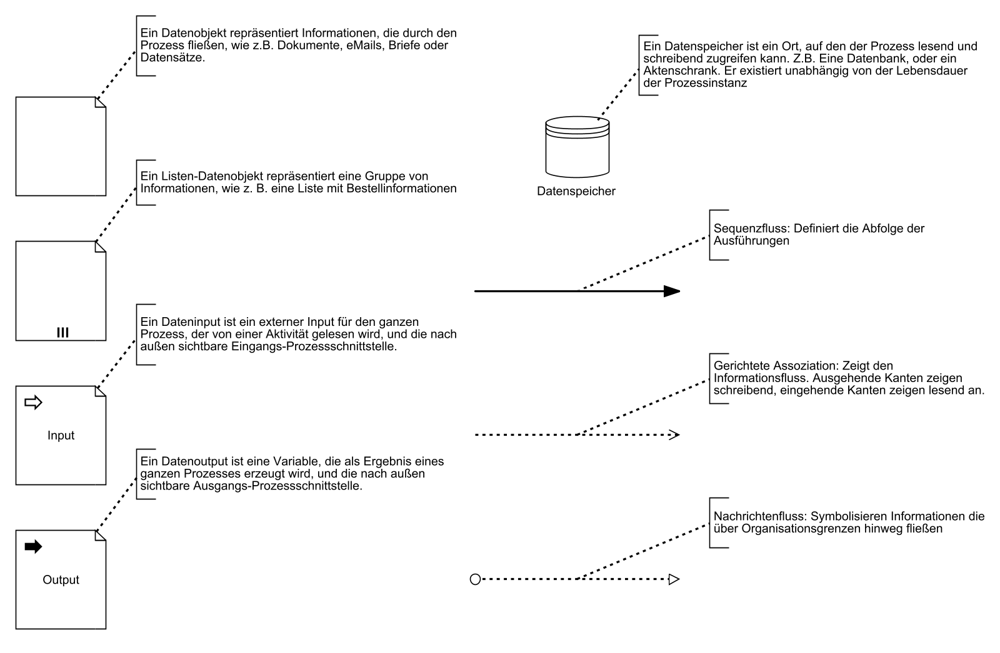
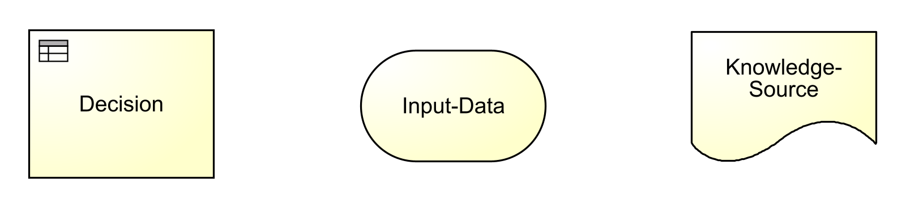

# Über lernOS

Das Verb "lernos" ist die Zukunftsform von "lernen" auf Esperanto (mi lernos = ich werde lernen, ni lernos = wir werden lernen). **lernOS** ist ein **Betriebssystem** für **Lebenslanges Lernen** und **Lernende Organisationen**. lernOS ist aber keine Software, sondern "Brainware". Es ist eine Art zu Denken und zu Handeln, um als Einzelperson, Team oder Organisation im 21. Jahrhundert erfolgreich zu sein. Das groß geschriebene "OS" im Namen unterstreicht die Bedeutung der Digitalisierung für unsere vernetzte Wissensgesellschaft.

Zu lernOS gibt es **drei grundlegende Leitfäden**, die den Ansatz auf **individueller Ebene** (lernOS für Dich, [Präsentation](https://cogneon.github.io/lernos-for-you)), auf **Ebene von Teams** (lernOS für Teams) und auf **Ebene von Organisationen** (lernOS für Organisationen) beschreiben. Zusätzlich gibt es die **lernOS Toolbox**, die oft genutzte Methoden und Werkzeuge erklärt (z.B. Podcast, Barcamp, Sketchnoting, Expert Debriefing). lernOS ist nicht auf der sprichwörtlichen grünen Wiese entstanden, sondern ist eine Zusammenstellung von bereits bestehenden und bewährten Methoden. Alle lernOS Leitfäden sind unter der **offenen Lizenz Creative Commons Attribution (CC BY)** auf der [lernOS Webseite](https://cogneon.de/lernos) verfügbar und können gerne an die eigenen Bedürfnisse angepasst werden.

Wenn du **weitere Fragen** bezüglich lernOS hast oder **Unterstützung von Gleichgesinnten** suchst, kannst du die Community-Plattform [CONNECT](https://community.cogneon.de) und den [lernOS CircleFinder](https://community.cogneon.de/c/lernos/lernos-circlefinder) nutzen oder mit [#lernOS](https://twitter.com/search?q=%23lernOS) auf Twitter schreiben. Beachte: Die Meisterschaft von lernOS ist eine Frage von Monaten oder Jahren, nicht Stunden oder Tagen. Also: **Keep Calm & Learn On!**

Dein [@locutusvonborg](https://www.linkedin.com/in/alexander-rose-loci/)

Aus Gründen der besseren Lesbarkeit wird im Folgenden auf die gleichzeitige Verwendung weiblicher und männlicher Sprachformen verzichtet und das generische Maskulinum verwendet. Sämtliche Personenbezeichnungen gelten gleichermaßen für beide Geschlechter.

# Lizenz

lernOS Leitfäden stehen unter der Lizenz [Creative Commons Namensnennung 4.0 International](https://creativecommons.org/licenses/by/4.0/deed.de) (CC BY 4.0): 

**Du darfst:**

* **Teilen** - das Material in jedwedem Format oder Medium vervielfältigen und weiterverbreiten.
* **Bearbeiten** - das Material remixen, verändern und darauf aufbauen und zwar für beliebige Zwecke, sogar kommerziell.

**Unter folgenden Bedingungen:**

- **Namensnennung** - Du musst angemessene Urheber- und Rechteangaben machen, einen Link zur Lizenz beifügen und angeben, ob Änderungen vorgenommen wurden. Diese Angaben dürfen in jeder angemessenen Art und Weise gemacht werden, allerdings nicht so, dass der Eindruck entsteht, der Lizenzgeber unterstütze gerade Sie oder Ihre Nutzung besonders.
- **Keine weiteren Einschränkungen** - Du darst keine zusätzlichen Klauseln oder technische Verfahren einsetzen, die anderen rechtlich irgendetwas untersagen, was die Lizenz erlaubt.

# Grundlagen

## Was ist Prozessmodellierung?

Bei der **[Prozessmodellierung](https://de.wikipedia.org/wiki/Geschäftsprozessmodellierung)**  werden Geschäftsprozesse oder Ausschnitte daraus abstrahiert, meist **grafisch** dargestellt und somit modelliert. Der Schwerpunkt liegt auf dem **Darstellen des Ablaufs,** aber auch der Fluss von Daten und die Zuständigkeit von Organisationen (bzw. Organisationseinheiten) können modelliert werden. Prozessmodellierung ist ein zentraler Aspekt der **ganzheitlichen Unternehmensabbildung** und wird in der Regel als ein **Teil des Geschäftsprozessmanagements** verstanden. 

### Was ist BPMN?

Die **[Business Process Model and Notation](https://de.wikipedia.org/wiki/Business_Process_Model_and_Notation)** (BPMN) ist eine **grafische Spezifikationssprache** in der Wirtschaftsinformatik und im Prozessmanagement. Sie stellt Symbole zur Verfügung, mit denen Fach-, Methoden- und Informatikspezialisten Geschäftsprozesse und Arbeitsabläufe modellieren und dokumentieren können.  BPMN wurde der von der Object Management Group (OMG) definiert. [ISO-Norm: 19510:2013](https://www.omg.org/spec/BPMN/ISO/19510/PDF)

### Was ist BDM?

[**Business Decision Management**](https://en.wikipedia.org/wiki/Decision_management) (BDM) stellt Konzepte, Methoden und Techniken für die Darstellung, Verwaltung, Konfiguration, Durchführung und Analyse von Geschäftsentscheidungen zur Verfügung. BDM dient als Methode, um komplexe Entscheidungsregeln zu modellieren und so die Entscheidungsfindung zu verbessern.

### Was ist DMN?

**[Decision Model and Notation](https://de.wikipedia.org/wiki/Decision_Model_and_Notation)** (DMN) ist ein offizieller Notationsstandard für Entscheidungsregeln im Geschäftsprozessmanagement, der von der Object Management Group (OMG) definiert wurde. Dieser Standard wird zum **Beschreiben und Modellieren von wiederholbaren Entscheidungen** in Organisationen genutzt. DMN ermöglicht Nutzern aus den verschiedensten Abteilungen, effektiv bei der Entscheidungsmodellierung zusammenzuarbeiten. 

## Warum ein Lernpfad Prozessmodellierung?

In der aktuellen [VUCA](https://de.wikipedia.org/wiki/VUCA)-Welt, in der die [digitale Transformation](https://de.wikipedia.org/wiki/Digitale_Transformation) und die damit verbundene Automatisierung von Arbeitsabläufen und Geschäftsprozessen in jede Branche unaufhaltsam vordringt, wird die Kompetenz, bestehende Geschäftsprozesse lesen und neue Geschäftsprozesse modellieren zu können, von sehr hohem Nutzen für dich sein. In Kombination mit der Fertigkeit, [Geschäftsregeln](https://de.wikipedia.org/wiki/Gesch%C3%A4ftsregel) verstehen und modellieren zu können, besitzt du die optimalen Voraussetzungen, um als Bindeglied zwischen dem Business (Fachbereich) und der IT-Abteilung durch eine gemeinsame verbindende Sprache (BPMN & DMN) die Digitale Transformation entscheidend nach vorne zu bringen.

Dieser Lernpfad funktioniert für **alle Erfahrungsstufen** und richtet sich somit an alle Interessenten dieses Themas. Es sind **keine Vorkenntnisse** nötig. Es ist egal, ob du noch nie etwas von Prozessmodellierung gehört hast oder bereits erfolgreich erste Modellierungen vorgenommen hast. 

Das bedeutet auch, dass die Übungen eine **steile Lernkurve** für dich bereithalten.  Alle BPMN-Übungen sind so angelegt, dass sie auch mit einem Stift und einem Blatt Papier durchführbar sind.

Wie bei allem gilt auch beim Modellieren: **Übung macht den Meister!**

Dafür haben wir den **Lernpfad Prozessmodellierung** entwickelt. Er enthält unter anderem:

- 11 Lerninhalte mit den wichtigsten Grundlageninformationen
- 11 Katas (Übungen) zu den wichtigsten Bereichen der Prozessmodellierung
- Zahlreiche Ressourcen zur weiteren Vertiefung

## Aufbau dieses Lernpfades

Die meisten Katas stehen in 2 Varianten zur Verfügung:

1. Eine konkrete vorgegebene Aufgabe
2. Eine Aufgabe ohne spezielle Vorgaben

Es muss **nur eine** der beiden Varianten bis zum nächsten Weekly erarbeitet werden. Beide Varianten haben didaktische  Vor- und Nachteile. Dieser Ansatz trägt dem Umstand Rechnung,  verschiedene Leistungsstufen innerhalb eines Circles  bedienen zu wollen. Während Variante 1 eher für Beginner gedacht und sehr gut dazu geeignet ist, sich im Weekly gegenseitiges Feedback zu geben, ist Variante 2 eher für Fortgeschrittene gedacht, die bereits ihre konkreten eigenen Ideen & Aufgabenstellungen lösen wollen. 

# Lernpfad Prozessmodellierung

## Mach dich mit den Grundlagen vertraut (KATA 01) {#kata01}

In dieser Kata machst du dich mit den <u>wichtigsten Grundelementen</u> der Prozessmodellierung vertraut. Nimm dir etwas Zeit für diese Übung, da du viele neue Dinge lernen wirst. In dieser Kata geht es um das <u>erstmalige Kennenlernen</u>. In den  Kata der folgenden Wochen werden wir alle Themen an praktischen Beispielen weiter vertiefen

**Dauer:** ca.  60 Minuten

- Besuche die Seite  [Business Process Model and Notation (BPMN) — Einführung](https://www.signavio.com/de/bpmn-einfuehrung/) und lies sie dir gründlich durch. 
- Notiere deine Erkenntnisse & Herausforderungen zur Reflektion im Weekly

## Dein erstes Diagramm (Happy-Path) (KATA 02) {#kata02}

In einer idealen Welt geht immer alles glatt. Es gibt keine Störungen oder unvorhergesehene Ereignisse.  I.d.R. gibt es auch nichts zu entscheiden. In der Welt der Prozessmodellierung nennen wir diesen Weg den Happy-Path. Tatsächlich beginnen wir bei einem neuen Prozessmodell zunächst immer mit der einfachsten Variante. Komplizierter wird es später schon ganz von alleine.

**Dauer:** ca. 30 Minuten

Schaue dir zunächst die [<*Lernunterlagen*>](#LU-HappyPath) an und modelliere dann: 

1. Einen **beliebigen** Happy-Path unter Einhaltung der eben erlernten Regeln 
2. Einen Happy-Path, der den Prozess der "**Tee-Zubereitung**" beschreibt

- Notiere deine Erkenntnisse & Herausforderungen zur Reflektion im Weekly

## Triff deine ersten Entscheidungen (KATA 03) {#kata03}

Leider, oder besser zum Glück,  ist der Happy-Path die Ausnahme. Denn wir können die Dinge beeinflussen, indem wir entscheiden. BPMN bietet eine ganze Reihe verschiedener Entscheidungsmöglichkeiten (Gateways), die du in dieser Kata kennenlernen und anwenden wirst.

**Dauer:**  60 Minuten

Schaue Dir zunächst die [<*Lernunterlagen*>](#LU-Gateways) an und modelliere dann:

1. Einen **beliebigen Prozess** deiner Wahl mit mindestens zwei verschiedenen Gateway  
2. Die "**Tee-Zubereitung**" mit einem OR Gateway (mindestens 3 Zweige)

- Notiere deine Erkenntnisse & Herausforderungen zur Reflektion im Weekly

## Exkurs - Markierungen, Aufgabentypen &  Daten (KATA 04) {#kata04}

*Attribute mit visuellen Effekten*

Die BPMN-Spezifikation sieht eine Vielzahl von Attributen der Objekte vor, jedoch haben nur wenige dieser Attribute auch visuelle Auswirkungen. Dennoch kann es sehr hilfreich sein, über die Attribute direkt auf den Objekten einen **schnellen Überblick** zu bekommen. Die Liste in den Lernunterlagen gibt dir einen Überblick über die wichtigsten dieser Attribute. 

**Dauer**: 60 Minuten

Schaue Dir zunächst die [<*Lernunterlagen*>](#LU-Markierungen) an und modelliere dann:

1. Ein **beliebiges Prozessdiagramm** mit mindestens 6 verschiedenen Elementen aus dieser Übung.
2. Modelliere die "**Tee-Zubereitung**" weiter aus:
   * Jede Aufgabe hat ein zugewiesenes Attribut
   * Ein Datenobjekt
   * Eine Kombination von XOR und AND Gateway

- Notiere deine Erkenntnisse & Herausforderungen zur Reflektion im Weekly

## Von Pools und Lanes (KATA 05) {#kata05}

Nachdem wir jetzt sehr viel über die Beziehungen und Abhängigkeiten der Elemente in einem Prozessdiagramm gelernt haben, kommen wir nun zu den **Verantwortlichkeiten**. Diese werden in BPMN durch Pools und Lanes beschrieben.

**Dauer:**  90 Minuten

Schaue Dir zunächst die [<*Lernunterlagen*>](#LU-Pools) an und modelliere dann:

1. Ein **beliebiges Prozessdiagramm** mit mindestens 3 Pools und 6 Lanes

2. Die **„Getränkelieferung“**. Du veranstaltest eine Party und dein Auto ist nicht groß genug um die Getränke selbst zu holen. Deshalb gehst du daher auf die Homepage eines Getränkehandels und suchst die gewünschten Getränke aus. 

   Die Bestellung gibst du online auf. Danach geht diese beim Getränkehandel ein. Dort wird deine Bestellung in der Verwaltung bearbeitet und ein Bestellschein erstellt. Dieser wandert elektronisch in die Abteilung für alkoholfreie Getränke und in die Abteilung für alkoholische Getränke. 

   Dort wird geprüft, ob die gewünschte Ware auf Lager ist. Sollte die gewünschte Ware nicht vorhanden sein, wird diese im Großmarkt bestellt und gewartet bis diese eingeht. Sollte die bestellte Ware innerhalb von 24 Stunden nicht geliefert werden, wird von der entsprechenden Abteilung telefonisch erinnert. 

   Wenn die Ware eingeht, bzw. wenn die Ware vorrätig ist, wird sie durch die entsprechende Abteilung zusammengestellt und an das Lager geliefert. Dort werden die Waren aus beiden Abteilungen zusammengebracht, auf eine Palette gepackt und die Rechnung geschrieben. Danach wird die Verwaltung elektronisch informiert, dass die Bestellung abholbereit ist und eine Kopie der Rechnung übermittelt.(An wen wird die Rechnung übermittelt?) 

   Da der Getränkemarkt selbst keine Fahrer beschäftigt, wird für die Auslieferung durch die Verwaltung eine Getränkespedition beauftragt. Diese holt die Bestellung und die Rechnung im Lager ab und liefert diese an dich aus. 

   Neben den Getränken erhältst von der Getränkespedition auch die Rechnung, welche du bar begleichst und eine Quittung hierfür bekommst. Du kannst die Getränke nun verstauen und die Party kann beginnen. 

   Die Getränkespedition bringt noch eine Kopie der Quittung und das Bargeld in die Verwaltung des Getränkemarkts. Damit ist der Auftrag für die Getränkespedition erledigt. In der Verwaltung wird noch das Geld verbucht und auch hier ist die Lieferung damit abgeschlossen.

- Notiere deine Erkenntnisse & Herausforderungen zur Reflektion im Weekly

## Exkurs - Eventtypen (KATA 06) {#kata06}

Neben den schon bekannten Events, bietet BPMN eine ganze Reihe weiterer Eventtypen, um alle Eventualitäten des richtigen Lebens abbilden zu können. Grundsätzlich unterscheiden wir in Start-, Zwischen- und Endereignisse. Die Zwischenereignisse werden nochmals in "*eintretend*" und "*auslösend*" unterteilt. In dieser Kata lernst du die häufigsten Eventtypen kennen.

**Dauer:**  90 Minuten

Schaue Dir zunächst die [<*Lernunterlagen*>](#LU-Eventtypen) an und modelliere dann:

1. Ein **beliebiges Prozessdiagramm** mit mindestens 6 verschiedenen Eventtypen (Start/Zwischen/Ende)

2. Die **Tee-Zubereitung**: Modelliere deine bisherige Tee-Zubereitung weiter. Verwende mindestens:
   * Einem eingetretenen Bedingungszwischenereignis
   * Einem angehefteten Fehlerzwischenereignis 
   * Einem eingetretenen Zeitzwischenereignis
   * Eine angeheftete Standard Ende Kompensation

- Notiere deine Erkenntnisse & Herausforderungen zur Reflektion im Weekly

## Unterprozesse und Nachrichtenflüsse (KATA 07) {#kata07}

In dieser Kata lernst du die Funktion von Unterprozessen sowie die Kommunikation zwischen verschiedenen Pools kennen. Dies wird dir helfen, komplexere Prozesse übersichtlich zu halten und die Kommunikation zwischen verschiedenen Organisationen zu visualisieren. 

**Dauer:**  60 Minuten

Schaue Dir zunächst die [<*Lernunterlagen*>](#LU-Unterprozesse) an und modelliere dann:

- Ein **beliebiges Prozessdiagramm** mit mindestens einem Unterprozess und einem Nachrichtenfluss
- Die **Getränkelieferung 1.1**: In der KATA05 habt ihr die Getränkelieferung bereits modelliert. Diese werden wir nun noch etwas optimieren. Die Abläufe in der Abteilung für alkoholfreie Getränke und alkoholische Getränke sind eigentlich komplett identisch. Wir können daher einen Unterprozess nutzen, auf den beide Abteilungen zugreifen. Modelliere das in den bestehenden Prozess. Außerdem gibt es auch noch den Getränkegroßmarkt. Dieses haben wir bisher noch nicht berücksichtigt. Da wir nicht wissen, was dort abläuft, finde eine Möglichkeit diesen trotzdem darzustellen und die Kommunikation zwischen Getränkemarkt und Großhandel zu modellieren.
- Notiere deine Erkenntnisse & Herausforderungen zur Reflektion im Weekly

## Decision Model and Notation (DMN) - Grundlagen (KATA 08) {#kata08}

Ab diesem Kapitel tauchen wir in die spannende Welt der Modellierung von Regelwerken ein. Diese Welt erweitert die dir bisher bekannten Möglichkeiten der Modellierung enorm und erschließt ganz neue Bereiche, die besonders für die Automatisierung von Prozessen nützlich sind. In dieser Kata lernst du die **Grundelemente** von DMN kennen. Du  erarbeitest die Unterschiede zwischen BPMN & DMN und beschäftigst dich mit **Entscheidungstabellen**.

**Dauer:** 90 Minuten

Schaue dir zunächst die [<*Lernunterlagen*>](#LU-DMN) an und modelliere dann:

1. Ein **beliebiges DMN** mit mindestens 3 Entscheidungsvarianten

2. **Die Essensentscheidung**

   Du kommst am Abend von der Arbeit und musst dich entscheiden, was du Essen willst. Es gibt natürlich viele Möglichkeiten. Wenn du Zeit, Geld und Lust zum Ausgehen hast, gehst du Essen. Wenn du zwar Zeit und Lust hast, aber das nötige Kleingeld fehlt, dann musst du dir wohl selbst etwas kochen, genauso ist dies der Fall, wenn dir die Zeit fehlt. Sollest du Zeit und Geld haben, aber einfach keine Lust auszugehen, dann wird etwas zum Essen bestellt. Wenn du alles drei nicht hast, fällt das Abendessen wohl aus. Modelliere dein erstes eigenes DMN und sehe was der Abend bringt.

- Notiere deine Erkenntnisse & Herausforderungen zur Reflektion im Weekly

## Datentypen und HIT-Policy (KATA 09) {#kata09}

Hit-Policies bestimmen, wie die Entscheidungstabelle mit Eingaben umgeht, die mehrere oder gar keine Regeln erfüllen. Sie stellen das **Herzstück** des DMN-Universums dar, denn genau hier werden die Entscheidungen nach den vorgegebenen Regelwerken getroffen. 

**Dauer:**  90 Minuten

Schaue dir zunächst die [<*Lernunterlagen*>](#LU-Datentypen) an und modelliere dann:

1. Eine Entscheidungstabelle deiner Wahl mit mindestens **drei verschiedenen Eingängen** und **zwei verschiedenen Datentypen**.

2. Ein Autoverleih verwendet verschiedene Regeln bevor ein Auto verliehen wird. Die Firma prüft folgende Regeln um zu entscheiden, ob ein Kunde geeignet ist.

   a) Der Kunde muss mindestens 18 Jahre alt sein

   b) Nichtmitglieder unter 23 Jahren müssen mindestens 4 Jahre Fahrpraxis haben

   c) Mitglieder unter 23 Jahre müssen mindestens 2 Jahre Fahrpraxis haben

- Notiere deine Erkenntnisse & Herausforderungen zur Reflektion im Weekly

**Bonus-Kata**: Ein Mobilfunkanbieter bietet seinen Kunden eine neues Premiummodell an, bei dem jeder Kunde VIP, Gold oder Standard Status erhalten kann. Der Status im Speziellen hängt von der Art des Kundenvertrags sowie dem Jahresumsatz ab.

a) Alle Kunden mit einem Geschäftsvertrag und einem Jahresumsatz von mindestens 1.500 € erhalten VIP Status

b) Alle Kunden mit einem Geschäftsvertrag und einem Jahresumsatz unter 1.500 € erhalten Gold Status

c) Alle Kunden mit einem privaten Vertrag und einem Jahresumsatz von mindestens 1.000 € erhalten ebenfalls Gold Status 

d) Alle Kunden Kunden mit privaten Verträgen und einem Jahresumsatz unter 1.000 € werden Standardkunden

**Pro-Tipp:** Wenn du dich noch tiefer mit dem Thema auseinandersetzen willst, findest du hier eine weitere Möglichkeit : [Literal Expressions (Funktionen in DMN-Entscheidungen) verwenden](https://documentation.signavio.com/suite/de/Content/process-manager/userguide/dmn/use-literal-expressions.htm)

## Dein erstes komplexes DRD (KATA 10) {#kata10}

Wie im richtigen Leben zeigt sich auch hier, dass sich Komplexität leichter in den Griff bekommen lässt, wenn man sie in ihre Einzelteile zerlegt. In dieser Kata lernst du, wann es Sinn macht, Entscheidungen in Teilentscheidungen zu zerlegen und welche verschiedenen Namenskonventionen es gibt. Ein **Decision Requirements Diagram** (DRD) visualisiert dies anschaulich.

**Dauer:**  45 Minuten

Schaue dir zunächst die [<*Lernunterlagen*>](#LU-DRD) an und modelliere dann:

1. Ein beliebiges DMN mit 3 **drei verschiedenen Decisions**, **zwei verschiedene Input-Data** und **eine Knowledge-Source**.
2. Modelliere die "Tee-Zubereitung" weiter aus:
   * Tee:
      - Schwarz
      - Grün
      - Kräuter
      - Roibusch
   * Es gibt Veredelung:
      - Milch
      - Zucker
      - Honig
      - Süsstoff
   * Anzahl der Gäste
   * Ausgabe
     - Liefereinheit (Tasse, Kanne)
     - Zubereitunsart (Beutel, Lose)
     - Geschätze Zubereitungszeit
     
   
   a) Wenn mehr als 3 Gäste dann ist die Liefereinheit eine Kanne und die Zubereitunsart ist Lose
   
   b) Wenn (Zucker, Honig) und Süsstoff dann Liefereinheit Tasse und Zubereitunsart Beutel
   
   c) Wenn Roibusch Tee ist dann die Zubereitunsart Beutel
   
   d) Für jeden Gast 1 Minute Zubereitungszeit
   
   e) Für eine Kanne 2 Minuten Zubereitunszeit extra
   
   f) Für Lose 1 Minute Zubereitungszeit extra
   
- Notiere deine Erkenntnisse & Herausforderungen zur Reflektion im Weekly

## Dein Meisterstück (KATA 11) {#kata11}

In der letzten Kata geht es um's Ganze. Alles was du bisher gelernt hast, sollst du in deinem Meisterstück korrekt zur Anwendung bringen. Optimalerweise suchst du dir einen Prozess aus, den du selber gut kennst und den du auch gut beschreiben kannst. Ein Beispiel aus deiner täglichen Arbeit oder aus deinem Privatleben wird dir sicher schnell einfallen.

**Dauer:** 120 - 240 Minuten (Je nach Ausprägung deines Prozesses)

Folgende Komponenten sollte dein Meisterstück mindestens enthalten:

- 3 Pools mit Nachrichtenflüssen & mindestens 2 Lanes in einem Pool

- 1 Unterprozess

- Tasks mit verschiedenen Attributen

- Verschiedene Datenobjekte

- Verschiedene Eventtypen: Mindestens ein Link-Event und ein angeheftetes Kompensations-Zwischenevent sowie ein Signal-Event

- Verschiedene Gateways: Mindestens ein Event-Gateway

- 1 DRD mit 2 kaskadierenden Decisions und 4 Input-Data & 2 Knowledge-Sources

- 2 unterschiedliche HIT-Policies (Single & Multiple)

Bringe dein Meisterstück in das letzte Weekly mit und stelle es den anderen Teilnehmern vor.

**Pro-Tipp:** Die Feuertaufe. Lass dein Meisterstück von den anderen Circlern im Weekly präsentieren. Wenn die anderen deinen Prozess ohne Rückfragen verstehen, dann hast du die Meisterprüfung mit Auszeichnung bestanden. Diese Variante dauert aber erheblich länger.

## Retrospektive & Feier

In dieser Woche gibt es kein klar definiertes Programm mit weiteren Übungen. Das Ergebnis eurer Arbeiten habt ihr schon in Woche 11 vorgestellt - jetzt ist die Zeit, den Sprint **gemeinsam ausklingen** zu lassen.

- **Your Learning Moments:** Sprecht über die Momente im Sprint, die für euch besonders waren. Was sind eure "key learnings"? Überlegt, ob ihr diese als [lernOS Story](https://docs.google.com/forms/d/e/1FAIpQLSc9KrufUD9Mu9wstGv8ojfChRwPlq2dVi_kAUB04MuymmzUSg/viewform) für alle anderen Praktiker veröffentlichen wollt. *(20 Minuten)*
- **After Action Review:** Was war der Plan für den Sprint? Was ist passiert? Gab es eine Abweichung? Was kann man daraus lernen? *(20 Minuten)*
- **Check-out:** Gibt es nächste Schritte? Bleibt ihr für einen weiteren Sprint zusammen?
- **Party Time!**  Schaut, ob ihr ein gemeinsames Mittagessen organisieren könnt. Oder noch besser, ihr geht Abends zusammen aus. Belohnt Euch, denn ihr habt es verdient! Ihr könnt stolz auf eure Leistungen sein .*(Die Dauer wählt ihr)*

------

# Lernunterlagen

## Dein erstes Diagramm (Happy-Path) {#LU-HappyPath}

- Schau dir die folgenden Folien in Ruhe an:

  

------

[<*Zurück zur KATA*>](#kata02)

------

## Triff deine ersten Entscheidungen {#LU-Gateways}

Mit Gateways kannst du den Prozessfluss steuern. Entscheidungen werden mit dem **Exklusiv-Gateway** (verzweigenden) dargestellt. Dieses Gateway wird häufig genutzt und auch als **XOR-Gateway** bezeichnet. 

### Exklusive Gateway (XOR) 

Im folgenden Beispiel teilt das Exklusive Gateway den Prozess in zwei mögliche Zweige auf. 

-einfach.png)

Exklusive Gateways (XOR) lenken den eingehenden Prozessfluss auf **genau einen** ausgehenden Pfad (Entweder/Oder-Entscheidung)

### Exklusive Gateway (XOR) mit mehreren Enden

Ein Prozess kann auch mehrere Endereignisse haben. Im diesem Beispiel gibt es drei mögliche Endereignisse. Welches davon eintritt, hängt von der Entscheidung ab, welches Gericht ausgewählt wird. 

-mehrere-Endergebnisse.png)

### Exklusive Gateway (XOR) split und join

In diesem Beispiel haben wir zwei Exklusive Gateways. Das erste teilt (split) den Prozess in zwei Zweige und das zweite führt diese Zweige wieder zusammen (join).

-Split-&-Join.png)

### Exklusive Gateway (XOR) Schleifen

Schleifen werden benutzt um darzustellen, dass Teile eines Prozesses unter Umständen wiederholt werden müssen, um das gewünschte Ziel zu erreichen.

-Schleifen.png)

### Parallele Gateways  (AND)

Aufgaben können oder müssen manchmal parallel ausgeführt werden. 

.png)

Parallele Gateways (AND) aktivieren **alle ausgehenden Zweige gleichzeitig.** Bei der Zusammenführung **wird auf alle Zweige/Pfade gewartet**.

### Kombination von XOR und AND Gateway (Das Tokenprinzip)

Im folgenden Beispiel wird der Salat parallel zum Hauptgericht, Steak oder Pasta, angerichtet. Es gibt zwei mögliche Kombinationen für die Mahlzeit: Steak mit Salat oder Pasta mit Salat.

Das Tokenprinzip in BPMN beschreibt, wie ein Prozess durchlaufen wird. Stell dir das Token wie einen Spielball bzw. eine Kugel vor. Die Kugel wird bei jedem Start des Prozesses erzeugt und durchläuft ihn. Bei einem exklusiven Gateway kann der Token nur einen Weg nehmen. Bei einem parallelen Gateway teilt sich der Token in mehrere Token auf, je nach Anzahl der folgenden Zweige.

In unserem Beispiel wird also am parallelen Gateway ein zweiter Token erzeugt. Diese beiden Token durchlaufen nun den parallelen Prozessabschnitt, bis sie durch das zweite AND-Gateway wieder zusammengeführt werden. Danach durchläuft der Token den restlichen Prozess und wird am Ende des Prozesses konsumiert .

.png)

### Inklusive Gateway (OR)

Manchmal benötigen Prozesse noch etwas mehr Flexibilität. Hier kommt das **Inklusive Gateway (OR)** zum Einsatz. Im Gegensatz zum parallelen Gateway sind **die ausgehenden Zweige optional,** jedoch muss mindestens einer durchlaufen werden.

.png)

Inklusive Gateways (OR) werden genutzt, wenn **eine oder mehrere** Bedingungen möglich sind.
Bei der Zusammenführung wird auf **alle gewählten Zweige** gewartet.

Es gibt in diesem Beispiel 7 mögliche Kombinationen.

**Formel: 2^N-1, hier: 2^3-1 = 7 (N = Anzahl der ausgehenden Zweige)**

- Ein Zweig: nur Steak; nur Salat; nur Pasta
- Zwei Zweige: Steak & Salat; Pasta & Steak; Pasta & Salat
- Alle Zweige: Pasta, Steak & Salat

[<*Zurück zur KATA*>](#kata03)

------

## Exkurs - Markierungen, Aufgabentypen & Daten {#LU-Markierungen}

[<*Zurück zur KATA*>](#kata04)

------

## Von Pools und Lanes {#LU-Pools}

In BPMN werden Verantwortlichkeiten (Organisationseinheiten, Abteilungen, Personen, Rollen) für Aufgaben mit Swimlanes (Pools und Lanes) dargestellt. Ein Prozess "gehört" zu einem Pool und ein Task wird von der jeweiligen Lane ausgeführt.

Folgende Benennungen von Pools & Lanes haben sich im Einsatz bewährt:

| Typ                   | Beispiel                                            |
| --------------------- | --------------------------------------------------- |
| Organisationseinheit  | Finanzen, Personal, Vertrieb, Service               |
| Stelle/Position       | Abteilungsleiter Finanzen, Führungskraft Recht, ... |
| Prozessbezogene Rolle | Mitarbeiter, Vorgesetzter, Prozessverantwortlicher  |
| Person                | Frau Schulze, Herr Meier                            |

Von der Personenbenennung ist jedoch abzuraten, da sich Personen ständig ändern können. Nutze  in dem Fall besser die **prozessbezogenen Rollen**.

Sabine, Ralf und Alex wollen etwas kochen.  Jeder bekommt Aufgaben zugewiesen.

Ein Task kann in BPMN nur zu **genau einer Lane** (Rolle / Verantwortlichkeit) gehören.

Ein **Task** kann auch **mehrere Beteiligte** haben. Dies wird mit zusätzlichen Beteiligten oder weiteren Lanes dargestellt.

[<*Zurück zur KATA*>](#kata05)

------

## Exkurs - Eventtypen {#LU-Eventtypen}

### Blanko-Zwischenereignis

In diesem Prozess sehen wir ein **Blanko-Zwischenereignis**. Es wird verwendet, um
wichtige Zustände oder Meilensteine in einem Prozess darzustellen und hat keine
weitere Funktion.

### Nachrichten-Zwischenereignis

Manchmal müssen erst Nachrichten, Waren oder Artikel eintreffen, bevor der Prozess weiterlaufen kann. Dies wird durch ein Nachrichten-Zwischenereignis dargestellt. Im Beispiel unten muss die Pizza erst geliefert werden, bevor sie verzehrt werden kann.

### Zeitereignisse

Zeitereignisse können Prozesse starten oder verzögern.

- **Start-Zeitereignis:** Zu diesen Zeitpunkten wird der Prozess gestartet.
- **Zwischen-Zeitereignis:** Zeitpunkte (auch wiederkehrende) oder Wartezeiten oder geplante Verzögerungen des Prozesses

### Eventbasierte Gateways

Im Prozess können unterschiedliche Ereignisse auftreten. Dargestellt wird das mit **ereignisbasierten Gateways**. Das **zuerst eintretende Ereignis** bestimmt den Zweig, dem der Prozessfluss folgt. Solange noch kein Ereignis eingetreten ist, wartet der Prozess. Im Beispiel rufen wir die Pizzeria an, falls sie nach 60 Minuten nicht geliefert hat.

### Eventbasierte Gateways (Schleifen)

Ereignisbasierte Gateways können auch für Schleifen verwendet werden. In diesem Beispiel wollen wir nicht weiter auf unsere Pasta warten, falls diese nach dreimaligen Nachfragen immer noch nicht geliefert wurde.

.png)

### Bedingungsereignisse

In diesem Beispiel siehst du die Verwendung von **Bedingungsereignissen** im Vergleich zu **Zeitereignissen**.

### Angeheftete Zwischenereignisse

Deadlines oder Abbruchbedingungen können mit **angehefteten Zwischenereignissen** dargestellt werden. Falls das Aussuchen der Pasta länger als 30 Minuten dauert, dann bestellen wir nicht, sondern backen Pizza.

### Link-Ereignis

Link-Ereignisse können genutzt werden, um komplexe Modelle aufzuteilen oder den Sequenzfluss auf den nächstfolgenden Prozess weiterzuleiten. Zwei zusammengehörende Link-Ereignisse repräsentieren dabei einen Sequenzfluss.

**Link-Ereignis**
Ein auslösendes und eintretendes Link-Ereignis mit **gleichem Namen** entspricht einem Sequenzfluss, d.h. Sie können große Prozesse in Abschnitte aufteilen.

Laut BPMN-Standard sollten sich die verlinkten Prozesse immer auf der **gleichen Prozesshierachie-Ebene** befinden. 

### Übersicht aller Ereignisse

Eine **vollständige Übersicht** aller BPMN Ereignisse findest du im [BPMN-Poster](http://www.bpmb.de/images/BPMN2_0_Poster_DE.pdf) auf der rechten Seite.

[<*Zurück zur KATA*>](#kata06)

------

## Unterprozesse und Nachrichtenflüsse {#LU-Unterprozesse}

### Unterprozesse

Zugeklappte Unterprozesse fassen mehrere Aufgaben (Tasks) zusammen. Damit können komplexe Prozesse übersichtlich dargestellt werden. 

------

Im nächsten  Beispiel wird die Anwendung von **angehängten Zwischenereignissen** an Unterprozessen gezeigt. Falls also die Pasta verkoch ist, wird eine Eskalation ausgelöst und Pasta bestellt. Dies sollte jedoch nicht der Standardpfad sein.

### Nachrichtenflüsse über Poolgrenzen

Externe Kommunikationspartner werden mit **zugeklappten Pools** dargestellt. Der Nachrichtenfluss zeigt den **Austausch von Informationen**. Der zugeklappte Pool verbirgt alle internen Aufgaben des Lieferanten, denn diese sind für uns in diesem Fall irrelevant. 

[<*Zurück zur KATA*>](#kata07)

------

## DMN - Grundlagen {#LU-DMN}

### Einführung

**Business Decision Management** (BDM) stellt Konzepte, Methoden und Techniken für die Darstellung, Verwaltung, Konfiguration, Durchführung und Analyse von Geschäftsentscheidungen zur Verfügung.
Die Übungen in den folgenden Katas sind zwar auch auf dem Papier machbar, allerdings empfehle ich die Nutzung einer [DMN Software](https://demo.bpmn.io/dmn), um mit den verschiedenen Varianten zu experimentieren und sich die Ergebnisse der selbst geschriebenen Entscheidungstabellen bestätigen zu lassen. 

Im folgenden findest du eine kurze, unvollständige Darstellung der **Nachteile "klassischer" Entscheidungswege**.

| Menschliche Entscheidungen    | Automatisierte Entscheidungen               |
| ----------------------------- | ------------------------------------------- |
| Unklare Regeln                | Fehlende Transparenz                        |
| Unsicherheiten                | Veraltete / falsche Entscheidungsgrundlagen |
| Langsame Entscheidungsfindung | Kostenintensive Anpassung                   |
| Inkonsistente Entscheidungen  | Hoher Kommunikationsaufwand                 |

**BDM** dient als Methode, um diese Probleme zu überwinden und die Entscheidungsfindung zu verbessern.

Das digitale Zeitalter und die zunehmenden gesetzlichen Regulierungen drängen Organisationen zu mehr Transparenz und Optimierung ihrer Entscheidungen.

| Das digitale Zeitalter                           | Erweiterte Vorschriften                                      |
| ------------------------------------------------ | ------------------------------------------------------------ |
| Mehr verfügbare Daten                            | Pflicht zur Nachvollziehbarkeit & Transparenz: Von der Anforderung bis zur Implementierung |
| Big Data Analyse                                 | Risiken für Verstöße gegen gesetzliche Vorschriften frühzeitig erkennen |
| Schneller auf veränderte Anforderungen reagieren | Vermeidung von Strafe                                        |

**Decision Model and Notation** (DMN) ist eine grafische Spezifikationssprache, die Elemente definiert, um Geschäftsentscheidungen zu modellieren und deren Logik zu dokumentieren. 
DMN dient als **Schnittstelle zwischen Modellierung und Implementierung** von Entscheidungslogik (Fachbereich & IT).

Geschäftsprozessmodelle können Entscheidungsdiagramme enthalten. Diese werden auf **zwei Ebenen** erstellt. Während in der ersten Ebene die **Anforderungen (Informationen)** für Entscheidungen beschrieben werden, beinhaltet die zweite Ebene die **Logik (Regeln).**

Beide Modelle haben ihren eigenen Zweck und ergänzen einander. Trotzdem können sie auch unabhängig voneinander existieren.

### Kernelemente von DMN

| Element          | Eigenschaft                                                  | Eigenschaft II                                        |
| ---------------- | ------------------------------------------------------------ | ----------------------------------------------------- |
| Desicion         | Benutzt Logik um Ergebnis zu bestimmen.                      | Zerlegung in Teilentscheidungen möglich.              |
| Input Data       | Stellt Informationen für Entscheidungen bereit.              | Kann von verschiedenen Entscheidungen genutzt werden. |
| Knowledge Source | Beschreibt die Quelle, aus der Regeln für die Entscheidung vorgegeben werden. | z.B. Gesetze, Regularien oder Richtlinien.            |

Bei der Erstellung von DMN-Modellen kann es hilfreich sein, sich an folgenden **Leitfragen** zu orientieren:

<u>Entscheidungen identifizieren und abgrenzen</u> 

- Welche Entscheidungen müssen überhaupt getroffen werden? 
- Was ist das Ziel dieser Entscheidungen? 

<u>Benötigte Anforderungen sammeln</u>

- Welche Informationen werden benötigt, um die Entscheidung zu treffen? 
- Wird die Logik aus externen Gesetzen / internen Richtlinien vorgeschrieben? 

<u>Entscheidungen aufteilen</u> 

- Müssen die benötigten Informationen ggf. selbst erst ermittelt werden? 
- Bei Unterentscheidungen analoges Vorgehen -> Anforderungen sammeln

Das kann z. B. so aussehen:

**Entscheidungsdiagramme** beantworten folgende **Fragen** auf leicht verständliche Weise:

- Welche Informationen werden benötigt? 
- Gibt es vorgelagerte Entscheidungen? 
- Gibt es externe oder interne Richtlinien? 
- Wie sind die Abhängigkeiten?

Hier siehst du ein beispielhaftes Entscheidungsdiagramm. Die genutzten Elemente werden im Folgenden im Detail erklärt.

### Entscheidungstabellen

Entscheidungslogik wird durch eine Tabelle dargestellt, die aus verschiedenen Komponenten besteht. In der Tabelle entspricht **jede Zeile einer Geschäftsregel**. Im Fall einer Autoversicherungsgesellschaft könnten solche Geschäftsregeln z. B. lauten:

- Personen mit mehr als zwei Unfällen in den letzten 3 Jahren wird keine Versicherung gewährt
- Personen unter 18 Jahren wird keine Versicherung gewährt
- Personen mit mehr als vier Punkten wird keine Versicherung gewährt

Diese Entscheidungstabelle beinhaltet 4 Geschäftsregeln. Jede einzelne Regel beschreibt dabei eine mögliche Kombination von Eingängen, in welcher jede zu einem bestimmten Ergebnis führt.

**Operatoren** werden benutzt, um Geschäftsregeln in der Tabelle abzubilden. Es gibt eine große Bandbreite an [Operatoren](https://documentation.signavio.com/suite/de/Content/process-manager/userguide/dmn/define-decision-logic.htm).

### Datentypen für Input-Data Elemente

In der Praxis können Informationen in verschiedenen Arten vorkommen z. B. als Text , als ein Zahlwert oder als ein Datum. Daher muss auch für jeden Input Data der zutreffende Datentyp festgelegt werden. Es gibt folgende Datentypen:

- Boolean: Wahr / Falsch (Wahrheitswert) 
- Zahlwert: 12, 33%, 45€ 
- Aufzählung: Hund, Katze, Maus 
- Text: Namen, Modellnummer: ED4637K 
- Datum: 08.05.1970
- Hierarchie: Abteilungsleiter, Teamleiter, Mitarbeiter

#### Boolean

Ein Input Data vom Typ **Boolean** besitzt einen von zwei möglichen Werten. Dieser Wert kann entweder **wahr** oder **falsch** sein. Boolean kann für einfache Abfragen genutzt werden.

.png)

In diesem Beispiel ist der Input Data "Stammkunde" vom Typ Boolean, da es hier nur 2 mögliche Ausprägungen geben kann. Entweder handelt es sich um einen Stammkunden **(wahr)** oder nicht **(falsch)**.

#### Zahlwert

Eingangsdaten vom Typ **Zahlwert** enthalten **numerische Werte**. Diese können Bereiche oder einfache Zahlen sein. Nummern werden von Operatoren (siehe vorheriges Kapitel) verglichen und können eine Einheit haben. 

.png)

In diesem Beispiel ist der Input Data "Einkaufswert" vom Typ Zahlwert.  Dieser Typ kann folgende Einheiten annehmen.

- Prozent
- Gewicht
- Länge
- Temperatur
- Währung

**Zahlwerte** können in verschiedenen Bereichen angegeben werden.

- Eckige Klammern für **geschlossene Intervalle** 
  - [1..5] zwischen 1 und 5, inklusive 1 und 5

- Runde Klammern für **offene Intervalle** 
  - (1..5) zwischen 1 und 5, exklusive 1 und 5

- **Gemischte(halb-offene) Intervalle** 
  - (1..5] zwischen 1 und 5, exklusive 1 und inklusive 5 
  - [1..5) zwischen 1 und 5, inklusive 1 und exklusive 5

#### Aufzählung

Ist der Datentyp einer Eingabe **Aufzählung,** wird eine **Liste von Auswahloptionen** vordefiniert. Diese Werte können durch Operatoren mit anderen Eingabewerten / Listen verglichen werden. 

Z.B. Express Versand, Standard Versand, ...)

.png)

Operatoren können sein:

- Gleich
- Ungleich
- Element von 
- Kein Element von 

#### Datum

Ein **Datum** wird genutzt, um **bestimmte Zeitpunkte** festzulegen. Durch Operatoren kann der Wert verglichen werden (zum Beispiel mit dem aktuellen Datum).

.png)

Operatoren können sein:

- Gleich
- Ungleich
- Größer als
- Kleiner als
- Größer oder gleich
- Kleiner oder gleich

#### Text

Der Datentyp **Text** wird für **Vermerke und andere textbasierte Informationen** benutzt. Da die Auswahl eines vordefinierten Wertes weniger fehleranfällig ist, als den Wert selbst einzutippen (Leerzeichen, Tippfehler etc.), sollten Texttypen wenn möglich durch Aufzählungen ersetzt werden. 

.png)

Operatoren können sein:

- Gleich
- Ungleich
- Enthält
- Enthält nicht
- Beginnt mit
- Endet mit 
- Element von 
- Kein Element von 

#### Hierarchie

Ein Eingang vom Typ **Hierarchie** listet **Werte in verschiedenen Kategorien** auf, die voneinander hierarchisch abhängig sind. Dies erlaubt die Anwendung von Entscheidungsregeln für eine gesamte Kategorie und/oder einzelne Werte.

.png)

Operatoren können sein:

- Gleich
- Ungleich
- Element von
- Kein Element von

[<*Zurück zur KATA*>](#kata08)

------

## Datentypen und Hit Policy {#LU-Datentypen}

### Single Hit Policies 

Bei diesen Hit Policy wird **immer nur eine Regel** in der Entscheidungstabelle angewendet, auch wenn mehrere Regeln zutreffen.

#### Unique Hit Policy (U)

Bei der Unique Hit Policy kann für jede Kombination an Eingaben **nur eine Regel zutreffen.** In diesem Kontext wird angenommen, dass alle Eingaben unabhängig voneinander sind, sodass jede Kombination tatsächlich möglich ist. Überlappende Regeln sind dabei **nicht erlaubt.**

Ein "**-**" steht für "**any**" und bedeutet, dass an dieser Stelle jeder mögliche Wert stehen kann.

**In Regel 2:** Ist die gewählte Versandart Expressversand und der Kundentyp Einzelhändler, spielt es keine Rolle ob Nahrungsmittel oder Sachgüter ausgewählt ist. Das Ergebnis wird immer eine hohe Lieferpriorität sein.

**In Regel 3:** Ist die gewählte Versandart Standardversand, die Güterart Nahrungsmittel und der Kundentyp Großhändler, haben wir eine hohe Lieferpriorität.

#### First Hit Policy (F)

Wird die First Hit Policy genutzt, können sich Regeln überschneiden, es wird allerdings **nur die erste zutreffende Regel** verwendet. Die First Hit Policy geht von einer **Sortierung der Regeln** aus. Sie werden von oben nach unten ausgewertet. Trifft in diesem Beispiel keine der ersten drei Regeln auf den Sachverhalt zu, kann die **letzte Regel** als allgemeine **“Auffangregel”** genutzt werden.

In diesem Beispiel wird zuerst geprüft, ob die Versandart Express Versand und der Kunde Großhändler ist. Wenn ja, tritt die Regel ein, ansonsten wird die zweite Regel geprüft. Stimmt diese nicht mit den Eingaben überein, wird die dritte Regel geprüft und so weiter.

#### Any Hit Policy (A)

Bei Verwendung der Any Hit Policy decken mehrere Regeln die gleiche Kombination an Eingabewerten ab. Diese Überschneidung ist jedoch nur erlaubt, wenn die Regeln auch zum gleichen Ergebnis führen.

Sobald eine der drei Kriterien mit "false" definiert wurde, also nicht zutrifft, führt dies direkt zum Ergebnis der VIP Anforderungen "nicht erfüllt". Somit sind nur bei einer gültigen Kombination von Input Data die VIP Anforderungen "erfüllt". 

#### Priority Hit Policy (P)

Mehrere Regeln können für einen Eingabewert eintreffen, wenn die Priority Hit Policy genutzt wird. Die Ergebnisse werden nach ihrer Priorität geordnet. Das Ergebnis mit der höchsten Priorität wird zurückgegeben.

Im obigen Beispiel, treffen Regel 3 und 4 zu, wenn das angegebene Alter '70' und die Krankengeschichte “schlecht” ist. Demnach wären die möglichen Ergebnisse Hoch und Mittel. Da „Mittel“ jedoch gegenüber „Hoch“ eine höhere Priorität besitzt, wird dieses Ergebnis ausgegeben.

### Multi Hit Policies 

Bei diesen Hit Policies werden **alle** zutreffenden Regeln betrachtet. Die erhaltenen Ergebnisse können entweder als Liste ausgegeben oder zu einem einzelnen Wert aggregiert werden (z.B. als Summe).

#### Output Order Policy (O)

Liefert alle Treffer in **absteigender Reihenfolge** der Ausgabepriorität. Die Ausgabeprioritäten werden in der geordneten Liste der Ausgabewerte in absteigende Reihenfolge ausgelesen.

Beispielrechnung:

- Input (50, 31) 
  - Die Regeln 1,2,4,5 und 6 werden aktiviert
- Output: 2,2,3,4,26 

#### Rule Order Policy (R)

Die Ausgaben aller **übereinstimmenden Regeln** werden als sortierte Liste zurückgegeben, in der
Reihenfolge der Regeln.

Beispielrechnung:

- Input (50, 31):
  - Die Regeln 1,2,4,5 und 6 werden aktiviert
- Output: 26,2,2,3,4

#### Collect Policy (C)

Die Ausgaben aller übereinstimmenden Regeln werden als unsortierte Liste zurückgegeben.

Alternativ können folgende Aggregationen der Ausgabewerte angewendet werden, wodurch nur genau ein Ergebnis auf Basis der Aggregation geliefert wird:

- Summierung: "+"
- Minimum:  "<"
- Maximum: ">"
- Anzahl: "#"

- Input (50, 31):
  - Die Regeln 1,2,4,5 und 6 werden aktiviert
- Output für C+ (Summierung): 37

[<*Zurück zur KATA*>](#kata09)

------

## Dein erstes komplexes DRD {#LU-DRD}

Das Diagramm zeigt, dass sehr viele Informationen berücksichtigt werden müssen, damit der Rabatt bestimmt werden kann. Um **große Entscheidungen** wie diese zu vermeiden, können Teile der Informationen in **untergeordnete Entscheidungen** ausgelagert werden. Doch wann sollten Entscheidungen überhaupt aufgeteilt werden? 

Sobald eine Entscheidung **mehr als sechs** Eingänge hat, wird die Entscheidungslogik sehr **komplex**. Jeder einzelne Informationseingang muss schließlich als Regel in der Entscheidungstabelle berücksichtigt werden. Hier ist es empfehlenswert, die verschiedenen Informationseingänge in einzelne Teilentscheidungen aufzuteilen.

Das Entscheidungsdiagramm ist nun auf eine strategische Entscheidung und drei untergeordnete Entscheidungen aufgeteilt. Dadurch ist das gesamte Diagramm leichter verständlich und die Abhängigkeiten sowie Eingangswerte sind besser erkennbar.

Zusätzlich ist die enthaltene Entscheidungslogik einfacher anzupassen. Eine einzelne Teilentscheidung kann jetzt geändert werden, ohne die Logik in den anderen Teilentscheidungen anpassen zu müssen.

Teilentscheidungen können in anderen Entscheidungsmodellen, ggf. sogar in einem ganz anderen Kontext, wieder verwendet werden. Ein paar Beispiele für solche wiederverwendbaren Teilentscheidungen sind "Status bestimmen" oder "Berechtigung prüfen".

In diesem Beispiel wird die Entscheidung **Kundenstatus** in zwei verschiedenen Modellen benötigt und kann dabei selbst in einem eigenen Entscheidungsmodell beschrieben sein. Im Ersten dient sie als Eingang für die Entscheidung **Bestimmung des Rabatts**. Im zweiten Entscheidungsdiagramm wird sie als Eingang zur Ermittlung der **Bestimmung der Lieferpriorität** verwendet.

Häufig werden Entscheidungen durch verschiedene externe oder interne Vorgaben bzw. Richtlinien beeinflusst. Dies kann durch die Verwendung des „Knowledge Source“ Elements dargestellt werden.

Zur besseren Übersicht ist es dabei oft hilfreich, die Entscheidung aufzuteilen und die beeinflussten Teilbereiche separat darzustellen.

Jede Entscheidung in einem Diagramm muss benannt werden. Damit jedoch auch für andere Betrachter klar verständlich ist, was genau entschieden wird, gibt es **verschiedene Benennungsarten.**  

| Benennungsstil  | Beschreibung                                                 | Beispiel                      |
| --------------- | ------------------------------------------------------------ | ----------------------------- |
| Aktivitätenstil | Die selbe Bezeichnung wie die zugehörige BPMN Aktivität. Objekt-Verb-Stil. Typische Verben sind prüfen, bestimmen, berechnen, auswählen und ermitteln | Kundenstatus ermitteln        |
| Ereignisstil    | Die Entscheidung wird nach Ihrem Ausgang benannt. Was wird entschieden? Enthält oft Wörter wie Anwendbarkeit, Eignung, Punktzahl oder Rangfolge | Kundenstatus                  |
| Fragenstil      | Die Entscheidung wird als Frage formuliert. **Achtung:** Fragen können sehr umfangreich sein und damit zu langen Bezeichnungen führen | Welchen Status hat der Kunde? |

[<*Zurück zur KATA*>](#kata10)

------

# Ressourcen & Quellennachweise

## Webseiten

[Business Process Model and Notation (BPMN) — Einführung](https://www.signavio.com/de/bpmn-einfuehrung/)

[Object Management Group - Business Process Model and Notation](https://www.omg.org/spec/BPMN)

[Object Management Group - Decision Model and Notation](https://www.omg.org/spec/DMN)

[IOZ](https://www.ioz.ch/de/prozessmanagement.html)

[BPMN Modelling Guidelines](https://www.modeling-guidelines.org/de/)

[BPMN - Poster](http://www.bpmb.de/images/BPMN2_0_Poster_DE.pdf)

[Blog von Bruce Silver](https://methodandstyle.com/blog/)

[BPMN Methoden & Stil Booklet](https://www.bpmessentials.com/wp-content/uploads/2017/10/Booklet-MethodStyle.pdf)

[BPMN 2.0 Cheat Sheet](https://www.signavio.com/de/downloads/kurzinfos/bpmn-2-0-cheat-sheet/)

[DMN 1.1 Cheat Sheet](https://www.signavio.com/de/downloads/kurzinfos/dmn-1-1-cheat-sheet/)

## Tools

[Web-based tooling for BPMN, DMN and CMMN](https://bpmn.io/)

[BIC Design](http://www.bicdesign-free.com/webedition/)

[BPM Free](https://www.bpm-free.de/)

[yEd Graph Editor](https://www.yworks.com/products/yed)

[Lucidchart](https://www.lucidchart.com/pages/de/landing/process-mapping-software)

[Bizagi Modeler](https://www.bizagi.com/de/produkte/plattform/modeler)

## Foren & Gruppen

[Xing-Forum: Berliner BPM - Offensive](https://www.xing.com/communities/groups/berliner-bpm-offensive-bdbf-1074763)

[LinkedIN-Gruppe: BPMN](https://www.linkedin.com/groups/111271/)

[LinkedIN-Gruppe: BPMN and beyond](https://www.linkedin.com/groups/115356/)

[LinkedIN-Gruppe: Decision Model and Notation (DMN)](https://www.linkedin.com/groups/4225568/)

## Literatur

[Praxishandbuch BPMN 2.0](https://www.amazon.de/Praxishandbuch-BPMN-2-0-Jakob-Freund/dp/3446442553/)

[BPMN Methode und Stil - Bruce Silver](https://www.amazon.de/Methode-Zweite-Auflage-Handbuch-Prozessautomatisierung/dp/0982368127)

[Prozess- und Entscheidungsmodellierung in BPMN/DMN - Eine Kurzanleitung](https://www.amazon.de/Prozess-Entscheidungsmodellierung-BPMN-Kurzanleitung-Prozessmodellierung/dp/1519542968)

[BUSINESS PROCESS MANAGEMENT - CONCEPTS, LANGUAGES, ARCHITECTURES](https://epdf.pub/business-process-management-concepts-languages-architectures.html)

## Video

[BPMN 2.0 - Grundelemente (Tutorial Part 1)](https://youtu.be/VappsiNgx38)

[BPMN 2.0 - Gateways (Tutorial Part 2)](https://youtu.be/pcefgu-D8b0)

[BPMN 2.0 - Aktivitäten (Tutorial Part 3)](https://youtu.be/QIFSaaAvLzg)

[BPMN 2.0 - Ereignisse (Tutorial Part 4)](https://youtu.be/4-OYKum7VnY)

[BPMN 2.0 - Pools & Lanes (Tutorial Part 5)](https://youtu.be/9Sjb-R44FBg)

[BPMN 2.0 - Daten (Tutorial Part 6)](https://youtu.be/a2HCoJUG0xs)

[Webinaraufzeichnungen](https://www.youtube.com/watch?v=jmQUloX_iv8&list=PLsdRG4tvgt7I93dd6O8YDWX9n7_oWwvCg)

## MOOC

[Business Processes: Modeling, Simulation, Execution](https://open.hpi.de/courses/bpm2019)

[Modellierung von Geschäftsprozessen mit BPMN](https://mooc.house/)

[Einführung in die Entscheidungsmodellierung mit DMN](https://mooc.house/)

Die überwiegenden hier verwendeten Bilder wurden mit [Signavio](https://www.signavio.com/de/) erstellt.

# Stop talking, start doing!

Wenn du diesen Leitfaden gelesen hast, lernOS aber noch nicht aktiv umsetzt, solltest du jetzt damit beginnen! Mit lernOS zu starten ist wirklich einfach. Diese fünf Schritte werden dir beim reibungslosen Start helfen:

1. **Zeit einplanen:** Definiere das Quartal, in dem du mit lernOS starten möchtest. Trage dir die Zeiten für das Weekly in den Kalender ein. Dieser regelmäßige Termin ist besonders wichtig, wenn du lernOS in einem Circle praktizierst.
2. **Ziele und Schlüsselergebnisse definieren:** Nutze Woche 0, um deine Ziele und messbare Ergebnisse für den Sprint festzulegen. Wähle ein Ziel, das dir wirklich, wirklich am Herzen liegt.
3. **Einen Circle gründen:** Suche nach 3-4 Mitstreitern, die im selben Quartal einen Sprint starten wollen. Wenn jemand schon in einem anderen Circle war, kann er die Rolle des Circle-Moderator übernehmen.
4. **Organisiere das Weekly:** Wenn Ihr Euch im Circle nicht kennt, trefft Euch in Woche 0 am besten persönlich. Nutzt soziale Netzwerke oder Messenger, um zwischen den Treffen zu kommunizieren. Nutzt Videokonferenzen, um virtuelle Treffen zu organisieren.
5. **Plan, Do, Learn, Repeat:** Nutzt das letzte Weekly in der Woche 12, um die Ergebnisse und die Zusammenarbeit im Kreis zu reflektieren. Entscheidet, ob Ihr einen weiteren Sprint gemeinsam durchlaufen wollt.

Keep Calm & Learn On! :-)

# Anhang

## Circle Moderator*innen Checkliste

**WOCHE 0 - Sprint Planung & Get Together**

Wenn Ihr Euch im Circle noch nicht kennt, lernt Euch in der Woche 0 kennen. Plant, wann Ihr Euch trefft, welche Tools Ihr nutzt und wer der Moderator ist.

- **Check-in:** Herzlich willkommen! *(5 Minuten)*
- **Get together:** Wer bist du? Stell dich vor. Fünf-Minuten-Timebox pro Circle-Mitglied. *(25 Minuten)*
- **Sprint Planung** siehe unten *(25 Minuten)*
- **Check-out:** Das nächste Treffen bestätigen. *(5 Minuten)*

Definiert einen Circle-Moderator, der sich um Event- und Zeitmanagement kümmert. Eines der größten Hindernisse für erfolgreiche Circle ist Disziplin und Zeitmanagement. Der Moderator ist nicht der "Chef" des Circle, sondern ein normales Circle-Mitglied, das sich um einen reibungslosen Ablauf kümmert. Legt fest, welchen Lernpfad ihr verwendet. Definiert Tag und Uhrzeit des wöchentlichen Treffens. Definiert, ob Ihr Euch persönlich oder virtuell trefft. Definiert die Tools, die Ihr für Kommunikation und Dokumentation im Circle verwendet. Entscheidet, ob Ihr den [lernOS Canvas](https://github.com/cogneon/lernos-core/tree/master/lernOS%20Canvas)   als unterstützendes Werkzeug verwenden möchtet.

- **Circle-Moderator:** ...
- **Tag und Uhrzeit des Weekly:** ...
- **Wöchentliche Treffen sind:** persönlich / virtuell
- **Verwendete Tools (können alle sie nutzen?):** ...
- **Benutzen wir den Canvas:** Ja / Nein

**ProTipp:** Wähle ein Ziel für die nächsten 12 Wochen. Verwende die Fragen "Ist es mir wirklich, wirklich wichtig?" Verwende die Methode [Objective & Key Results (OKR)](https://de.wikipedia.org/wiki/Objectives_and_Key_Results), um dein Ziel genauer zu beschreiben. Schreibe dein Ziel auf. Definiere 2-4 Schlüsselergebnisse pro Ziel, um dir bei der Fortschrittkontrolle zu helfen. Du solltest die Schlüsselergebnisse auf einer Skala von 0,0-1,0 messen können. Um sich ehrgeizige Ziele zu setzen, gilt eine Fertigstellungsrate von 0,7 als Erfolg.

**Pro-Tipp:** Eine strukturierte Dokumentation für die Reflektion im Weekly kann hilfreich sein. Folgende Fragen sollten beantwortet sein:

- Was war dir schon bekannt?
- Was war dir neu?
- Wo bestehen noch Fragen?

**ProTipp:** in vielen Fällen ist die Zeit für das Ausführen der Übungen im Weekly zu kurz. Verwendet daher die Methode [Flipped Classroom](https://en.wikipedia.org/wiki/Flipped_classroom): jedes Circle-Mitglied bereitet die Übungen als "Hausaufgabe" vor, so dass ihr im Weekly mehr Zeit habt, die Ergebnisse zu besprechen.

**ProTipp:** Wenn du das lernOS OneNote Circle Template verwendest, kannst du ein aktuelles Foto von Deinem Canvas machen und einfügen, damit die anderen Circle-Mitglieder es sehen und Feedback geben können.

**WOCHE 1 - 11**

- **Check-in:** Was habe ich seit dem letzten Check-in getan? Was hat sich bei den Schlüsselergebnissen getan? Was hält mich auf? Zwei-Minuten-Timebox pro Circle-Mitglied. *(10 Minuten)*
- **Kata-Diskussion** Zeigt Euch gegenseitig Eure Ergebnisse. Diskutiert Eure Erkenntnisse & Herausforderungen. *(45 Minuten)* 
- **Check-out:** Was werde ich bis zum nächsten Weekly tun? Eine-Minute-Timebox pro Circle-Mitglied. *(5 Minuten)*

**WOCHE 12: Retrospektive & Feier**

In dieser Woche sollte die endgültige Iteration deiner Key Results vorliegen. Sprecht darüber und zeigt sie im Check-in. Ihr werdet über die Erfahrungen im Circle nachdenken und darüber sprechen, wie ihr den Prozess aufrecht erhalten könnt. Nach dem Weekly solltet ihr euch etwas Zeit nehmen, um euren Erfolg zu feiern!

- **Check-in:** Was habe ich seit dem letzten Check-in getan? Zeigt die finale Iteration der Key Results. Drei-Minuten-Timebox pro Circle-Mitglied. *(15 Minuten)*
- **Your Learning Moments:** Sprecht über die Momente im Sprint, die für euch besonders waren. Was sind eure "key learnings"? Überlegt, ob ihr diese als [lernOS Story](https://docs.google.com/forms/d/e/1FAIpQLSc9KrufUD9Mu9wstGv8ojfChRwPlq2dVi_kAUB04MuymmzUSg/viewform) für alle anderen Praktiker veröffentlichen wollt. *(20 Minuten)*
- **After Action Review:** Was war der Plan für den Sprint? Was ist passiert? Gab es eine Abweichung? Was kann man daraus lernen? *(20 Minuten)*
- **Check-out:** Gibt es nächste Schritte? Bleibt ihr für einen weiteren Sprint zusammen?
- **Party Time!** *(Die Dauer wählt ihr)*

## Danksagungen

lernOS ist von vielen Personen und Quellen inspiriert und steht daher [auf den Schultern von Riesen](https://de.wikipedia.org/wiki/Zwerge_auf_den_Schultern_von_Riesen). Einen Überblick über die Wurzeln und Inspirationen sind [im lernOS Wiki](https://github.com/cogneon/lernos-core/wiki) zusammengestellt. Für diesen Leitfaden möchte ich besonders danken:

- [Hans Facher](https://www.linkedin.com/in/hans-facher-83957018a/)  für die Erarbeitung der KATA '**DMN Grundlagen**', '**Unterprozesse und Nachrichtenflüsse**'  und '**Von Pools & Lanes**'
- [Ralf Schramm](https://www.linkedin.com/in/ralf-schramm-00022448/) für die **Sketchnotes** zum Aufbau des Lernpfads & sein **technisches GIT-Knowhow**
- Bernd Neumayr für Erarbeitung der  Kata '**Dein erstes komplexes DRD**' & sein **technisches GIT-Knowhow**
- [Simon Dückert](https://www.linkedin.com/in/simondueckert/) für die **didaktische** und **technische Unterstützung**

Ein großes Dankeschön für konstruktives Feedback und Korrekturen geht an:

- [Alexander Wüstenfeld](https://www.linkedin.com/in/wuestenfeld/)
- [Daniel Kempa](https://www.linkedin.com/in/daniel-kempa-178570157/)

## Änderungshistorie

| Version | Bearbeitet von | Beschreibung der Änderung | Date |
|---------|----------------|-----------------------|-------|
| 1.0 | Alexander Rose | Erste Version des Lernpfads | 2020-02-15 |
