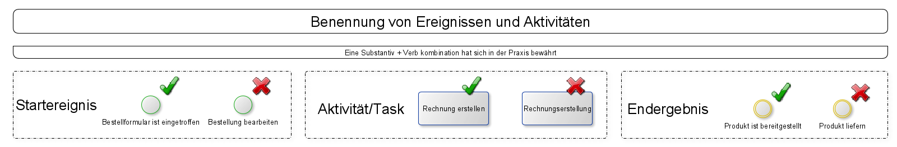
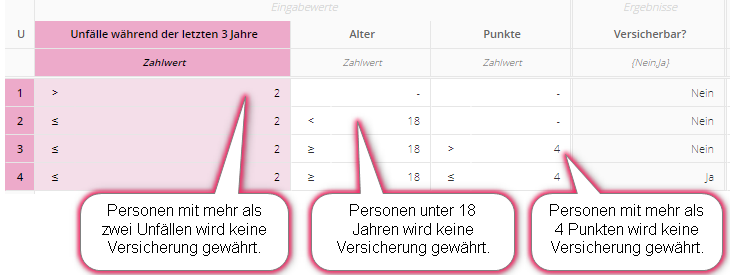
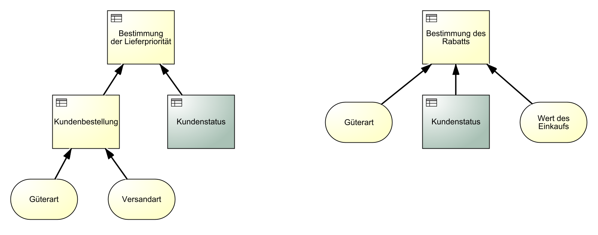
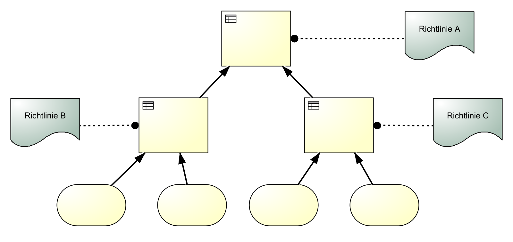

## Lernunterlagen

### Dein erstes Diagramm (Happy-Path)

- Schau dir die folgenden Folien in Ruhe an:

------

------

### Triff deine ersten Entscheidungen

Mit Gateways kannst du den Prozessfluss steuern. Entscheidungen werden mit dem **Exklusiv-Gateway** (verzweigenden) dargestellt. Dieses Gateway wird häufig genutzt und auch als **XOR-Gateway** bezeichnet.

#### Exklusive Gateway (XOR)

Im folgenden Beispiel teilt das Exklusive Gateway den Prozess in zwei mögliche Zweige auf.

-einfach.png)

Exklusive Gateways (XOR) lenken den eingehenden Prozessfluss auf **genau einen** ausgehenden Pfad (Entweder/Oder-Entscheidung)

#### Exklusive Gateway (XOR) mit mehreren Enden

Ein Prozess kann auch mehrere Endereignisse haben. Im diesem Beispiel gibt es drei mögliche Endereignisse. Welches davon eintritt, hängt von der Entscheidung ab, welches Gericht ausgewählt wird.

-mehrere-Endergebnisse.png)

#### Exklusive Gateway (XOR) split und join

In diesem Beispiel haben wir zwei Exklusive Gateways. Das erste teilt (split) den Prozess in zwei Zweige und das zweite führt diese Zweige wieder zusammen (join).

-Split-&-Join.png)

#### Exklusive Gateway (XOR) Schleifen

Schleifen werden benutzt um darzustellen, dass Teile eines Prozesses unter Umständen wiederholt werden müssen, um das gewünschte Ziel zu erreichen.

-Schleifen.png)

#### Parallele Gateways  (AND)

Aufgaben können oder müssen manchmal parallel ausgeführt werden.

.png)

Parallele Gateways (AND) aktivieren **alle ausgehenden Zweige gleichzeitig.** Bei der Zusammenführung **wird auf alle Zweige/Pfade gewartet**.

#### Kombination von XOR und AND Gateway (Das Tokenprinzip)

Im folgenden Beispiel wird der Salat parallel zum Hauptgericht, Steak oder Pasta, angerichtet. Es gibt zwei mögliche Kombinationen für die Mahlzeit: Steak mit Salat oder Pasta mit Salat.

Das Tokenprinzip in BPMN beschreibt, wie ein Prozess durchlaufen wird. Stell dir das Token wie einen Spielball bzw. eine Kugel vor. Die Kugel wird bei jedem Start des Prozesses erzeugt und durchläuft ihn. Bei einem exklusiven Gateway kann der Token nur einen Weg nehmen. Bei einem parallelen Gateway teilt sich der Token in mehrere Token auf, je nach Anzahl der folgenden Zweige.

In unserem Beispiel wird also am parallelen Gateway ein zweiter Token erzeugt. Diese beiden Token durchlaufen nun den parallelen Prozessabschnitt, bis sie durch das zweite AND-Gateway wieder zusammengeführt werden. Danach durchläuft der Token den restlichen Prozess und wird am Ende des Prozesses konsumiert .

.png)

#### Inklusive Gateway (OR)

Manchmal benötigen Prozesse noch etwas mehr Flexibilität. Hier kommt das **Inklusive Gateway (OR)** zum Einsatz. Im Gegensatz zum parallelen Gateway sind **die ausgehenden Zweige optional,** jedoch muss mindestens einer durchlaufen werden.

.png)

Inklusive Gateways (OR) werden genutzt, wenn **eine oder mehrere** Bedingungen möglich sind.
Bei der Zusammenführung wird auf **alle gewählten Zweige** gewartet.

Es gibt in diesem Beispiel 7 mögliche Kombinationen.

**Formel: 2^N-1, hier: 2^3-1 = 7 (N = Anzahl der ausgehenden Zweige)**

- Ein Zweig: nur Steak; nur Salat; nur Pasta
- Zwei Zweige: Steak & Salat; Pasta & Steak; Pasta & Salat
- Alle Zweige: Pasta, Steak & Salat

------

### Von Pools und Lanes

In BPMN werden Verantwortlichkeiten (Organisationseinheiten, Abteilungen, Personen, Rollen) für Aufgaben mit Swimlanes (Pools und Lanes) dargestellt. Ein Prozess "gehört" zu einem Pool und ein Task wird von der jeweiligen Lane ausgeführt.

Folgende Benennungen von Pools & Lanes haben sich im Einsatz bewährt:

| Typ                   | Beispiel                                            |
| --------------------- | --------------------------------------------------- |
| Organisationseinheit  | Finanzen, Personal, Vertrieb, Service               |
| Stelle/Position       | Abteilungsleiter Finanzen, Führungskraft Recht, ... |
| Prozessbezogene Rolle | Mitarbeiter, Vorgesetzter, Prozessverantwortlicher  |
| Person                | Frau Schulze, Herr Meier                            |

Von der Personenbenennung ist jedoch abzuraten, da sich Personen ständig ändern können. Nutze  in dem Fall besser die **prozessbezogenen Rollen**.

Sabine, Ralf und Alex wollen etwas kochen.  Jeder bekommt Aufgaben zugewiesen.

Ein Task kann in BPMN nur zu **genau einer Lane** (Rolle / Verantwortlichkeit) gehören.

Ein **Task** kann auch **mehrere Beteiligte** haben. Dies wird mit zusätzlichen Beteiligten oder weiteren Lanes dargestellt.

------

### Exkurs - Markierungen, Aufgabentypen & Daten

Hier lernst du die Attribute (Symbole links-oben oder unten-mittig), die BPMN für uns bereit stellt.

------

### Exkurs - Eventtypen

#### Blanko-Zwischenereignis

In diesem Prozess sehen wir ein **Blanko-Zwischenereignis**. Es wird verwendet, um
wichtige Zustände oder Meilensteine in einem Prozess darzustellen und hat keine
weitere Funktion.

#### Nachrichten-Zwischenereignis

Manchmal müssen erst Nachrichten, Waren oder Artikel eintreffen, bevor der Prozess weiterlaufen kann. Dies wird durch ein Nachrichten-Zwischenereignis dargestellt. Im Beispiel unten muss die Pizza erst geliefert werden, bevor sie verzehrt werden kann.

#### Zeitereignisse

Zeitereignisse können Prozesse starten oder verzögern.

- **Start-Zeitereignis:** Zu diesen Zeitpunkten wird der Prozess gestartet.
- **Zwischen-Zeitereignis:** Zeitpunkte (auch wiederkehrende) oder Wartezeiten oder geplante Verzögerungen des Prozesses

#### Eventbasierte Gateways

Im Prozess können unterschiedliche Ereignisse auftreten. Dargestellt wird das mit **ereignisbasierten Gateways**. Das **zuerst eintretende Ereignis** bestimmt den Zweig, dem der Prozessfluss folgt. Solange noch kein Ereignis eingetreten ist, wartet der Prozess. Im Beispiel rufen wir die Pizzeria an, falls sie nach 60 Minuten nicht geliefert hat.

#### Eventbasierte Gateways (Schleifen)

Ereignisbasierte Gateways können auch für Schleifen verwendet werden. In diesem Beispiel wollen wir nicht weiter auf unsere Pasta warten, falls diese nach dreimaligen Nachfragen immer noch nicht geliefert wurde.

.png)

#### Bedingungsereignisse

In diesem Beispiel siehst du die Verwendung von **Bedingungsereignissen** im Vergleich zu **Zeitereignissen**.

#### Angeheftete Zwischenereignisse

Deadlines oder Abbruchbedingungen können mit **angehefteten Zwischenereignissen** dargestellt werden. Falls das Aussuchen der Pasta länger als 30 Minuten dauert, dann bestellen wir nicht, sondern backen Pizza.

#### Link-Ereignis

Link-Ereignisse können genutzt werden, um komplexe Modelle aufzuteilen oder den Sequenzfluss auf den nächstfolgenden Prozess weiterzuleiten. Zwei zusammengehörende Link-Ereignisse repräsentieren dabei einen Sequenzfluss.

**Link-Ereignis**
Ein auslösendes und eintretendes Link-Ereignis mit **gleichem Namen** entspricht einem Sequenzfluss, d.h. Sie können große Prozesse in Abschnitte aufteilen.

Laut BPMN-Standard sollten sich die verlinkten Prozesse immer auf der **gleichen Prozesshierachie-Ebene** befinden.

#### Übersicht aller Ereignisse

Eine **vollständige Übersicht** aller BPMN Ereignisse findest du im [BPMN-Poster](http://www.bpmb.de/images/BPMN2_0_Poster_DE.pdf) auf der rechten Seite.

------

### Unterprozesse und Nachrichtenflüsse

#### Unterprozesse

Zugeklappte Unterprozesse fassen mehrere Aufgaben (Tasks) zusammen. Damit können komplexe Prozesse übersichtlich dargestellt werden.

------

Im nächsten  Beispiel wird die Anwendung von **angehängten Zwischenereignissen** an Unterprozessen gezeigt. Falls also die Pasta verkoch ist, wird eine Eskalation ausgelöst und Pasta bestellt. Dies sollte jedoch nicht der Standardpfad sein.

#### Nachrichtenflüsse über Poolgrenzen

Externe Kommunikationspartner werden mit **zugeklappten Pools** dargestellt. Der Nachrichtenfluss zeigt den **Austausch von Informationen**. Der zugeklappte Pool verbirgt alle internen Aufgaben des Lieferanten, denn diese sind für uns in diesem Fall irrelevant.

------

### DMN - Grundlagen

#### Einführung

**Business Decision Management** (BDM) stellt Konzepte, Methoden und Techniken für die Darstellung, Verwaltung, Konfiguration, Durchführung und Analyse von Geschäftsentscheidungen zur Verfügung.
Die Übungen in den folgenden Katas sind zwar auch auf dem Papier machbar, allerdings empfehle ich die Nutzung einer [DMN Software](https://demo.bpmn.io/dmn), um mit den verschiedenen Varianten zu experimentieren und sich die Ergebnisse der selbst geschriebenen Entscheidungstabellen bestätigen zu lassen.

Im folgenden findest du eine kurze, unvollständige Darstellung der **Nachteile "klassischer" Entscheidungswege**.

| Menschliche Entscheidungen    | Automatisierte Entscheidungen               |
| ----------------------------- | ------------------------------------------- |
| Unklare Regeln                | Fehlende Transparenz                        |
| Unsicherheiten                | Veraltete / falsche Entscheidungsgrundlagen |
| Langsame Entscheidungsfindung | Kostenintensive Anpassung                   |
| Inkonsistente Entscheidungen  | Hoher Kommunikationsaufwand                 |

**BDM** dient als Methode, um diese Probleme zu überwinden und die Entscheidungsfindung zu verbessern.

Das digitale Zeitalter und die zunehmenden gesetzlichen Regulierungen drängen Organisationen zu mehr Transparenz und Optimierung ihrer Entscheidungen.

| Das digitale Zeitalter                           | Erweiterte Vorschriften                                      |
| ------------------------------------------------ | ------------------------------------------------------------ |
| Mehr verfügbare Daten                            | Pflicht zur Nachvollziehbarkeit & Transparenz: Von der Anforderung bis zur Implementierung |
| Big Data Analyse                                 | Risiken für Verstöße gegen gesetzliche Vorschriften frühzeitig erkennen |
| Schneller auf veränderte Anforderungen reagieren | Vermeidung von Strafe                                        |

**Decision Model and Notation** (DMN) ist eine grafische Spezifikationssprache, die Elemente definiert, um Geschäftsentscheidungen zu modellieren und deren Logik zu dokumentieren.
DMN dient als **Schnittstelle zwischen Modellierung und Implementierung** von Entscheidungslogik (Fachbereich & IT).

Geschäftsprozessmodelle können Entscheidungsdiagramme enthalten. Diese werden auf **zwei Ebenen** erstellt. Während in der ersten Ebene die **Anforderungen (Informationen)** für Entscheidungen beschrieben werden, beinhaltet die zweite Ebene die **Logik (Regeln).**

Beide Modelle haben ihren eigenen Zweck und ergänzen einander. Trotzdem können sie auch unabhängig voneinander existieren.

#### Kernelemente von DMN

| Element          | Eigenschaft                                                  | Eigenschaft II                                        |
| ---------------- | ------------------------------------------------------------ | ----------------------------------------------------- |
| Desicion         | Benutzt Logik um Ergebnis zu bestimmen.                      | Zerlegung in Teilentscheidungen möglich.              |
| Input Data       | Stellt Informationen für Entscheidungen bereit.              | Kann von verschiedenen Entscheidungen genutzt werden. |
| Knowledge Source | Beschreibt die Quelle, aus der Regeln für die Entscheidung vorgegeben werden. | z.B. Gesetze, Regularien oder Richtlinien.            |

Bei der Erstellung von DMN-Modellen kann es hilfreich sein, sich an folgenden **Leitfragen** zu orientieren:

<u>Entscheidungen identifizieren und abgrenzen</u>

- Welche Entscheidungen müssen überhaupt getroffen werden?
- Was ist das Ziel dieser Entscheidungen?

<u>Benötigte Anforderungen sammeln</u>

- Welche Informationen werden benötigt, um die Entscheidung zu treffen?
- Wird die Logik aus externen Gesetzen / internen Richtlinien vorgeschrieben?

<u>Entscheidungen aufteilen</u>

- Müssen die benötigten Informationen ggf. selbst erst ermittelt werden?
- Bei Unterentscheidungen analoges Vorgehen -> Anforderungen sammeln

Das kann z. B. so aussehen:

**Entscheidungsdiagramme** beantworten folgende **Fragen** auf leicht verständliche Weise:

- Welche Informationen werden benötigt?
- Gibt es vorgelagerte Entscheidungen?
- Gibt es externe oder interne Richtlinien?
- Wie sind die Abhängigkeiten?

Hier siehst du ein beispielhaftes Entscheidungsdiagramm. Die genutzten Elemente werden im Folgenden im Detail erklärt.

#### Entscheidungstabellen

Entscheidungslogik wird durch eine Tabelle dargestellt, die aus verschiedenen Komponenten besteht. In der Tabelle entspricht **jede Zeile einer Geschäftsregel**. Im Fall einer Autoversicherungsgesellschaft könnten solche Geschäftsregeln z. B. lauten:

- Personen mit mehr als zwei Unfällen in den letzten 3 Jahren wird keine Versicherung gewährt
- Personen unter 18 Jahren wird keine Versicherung gewährt
- Personen mit mehr als vier Punkten wird keine Versicherung gewährt

Diese Entscheidungstabelle beinhaltet 4 Geschäftsregeln. Jede einzelne Regel beschreibt dabei eine mögliche Kombination von Eingängen, in welcher jede zu einem bestimmten Ergebnis führt.

**Operatoren** werden benutzt, um Geschäftsregeln in der Tabelle abzubilden. Es gibt eine große Bandbreite an [Operatoren](https://documentation.signavio.com/suite/de/Content/process-manager/userguide/dmn/define-decision-logic.htm).

#### Datentypen für Input-Data Elemente

In der Praxis können Informationen in verschiedenen Arten vorkommen z. B. als Text , als ein Zahlwert oder als ein Datum. Daher muss auch für jeden Input Data der zutreffende Datentyp festgelegt werden. Es gibt folgende Datentypen:

- Boolean: Wahr / Falsch (Wahrheitswert)
- Zahlwert: 12, 33%, 45€
- Aufzählung: Hund, Katze, Maus
- Text: Namen, Modellnummer: ED4637K
- Datum: 08.05.1970
- Hierarchie: Abteilungsleiter, Teamleiter, Mitarbeiter

**Boolean**

Ein Input Data vom Typ **Boolean** besitzt einen von zwei möglichen Werten. Dieser Wert kann entweder **wahr** oder **falsch** sein. Boolean kann für einfache Abfragen genutzt werden.

.png)

In diesem Beispiel ist der Input Data "Stammkunde" vom Typ Boolean, da es hier nur 2 mögliche Ausprägungen geben kann. Entweder handelt es sich um einen Stammkunden **(wahr)** oder nicht **(falsch)**.

**Zahlwert**

Eingangsdaten vom Typ **Zahlwert** enthalten **numerische Werte**. Diese können Bereiche oder einfache Zahlen sein. Nummern werden von Operatoren (siehe vorheriges Kapitel) verglichen und können eine Einheit haben.

.png)

In diesem Beispiel ist der Input Data "Einkaufswert" vom Typ Zahlwert.  Dieser Typ kann folgende Einheiten annehmen.

- Prozent
- Gewicht
- Länge
- Temperatur
- Währung

**Zahlwerte** können in verschiedenen Bereichen angegeben werden.

- Eckige Klammern für **geschlossene Intervalle**
  - [1..5] zwischen 1 und 5, inklusive 1 und 5

- Runde Klammern für **offene Intervalle**
  - (1..5) zwischen 1 und 5, exklusive 1 und 5

- **Gemischte(halb-offene) Intervalle**
  - (1..5] zwischen 1 und 5, exklusive 1 und inklusive 5
  - [1..5) zwischen 1 und 5, inklusive 1 und exklusive 5

**Aufzählung**

Ist der Datentyp einer Eingabe **Aufzählung,** wird eine **Liste von Auswahloptionen** vordefiniert. Diese Werte können durch Operatoren mit anderen Eingabewerten / Listen verglichen werden.

Z.B. Express Versand, Standard Versand, ...)

.png)

Operatoren können sein:

- Gleich
- Ungleich
- Element von
- Kein Element von

**Datum**

Ein **Datum** wird genutzt, um **bestimmte Zeitpunkte** festzulegen. Durch Operatoren kann der Wert verglichen werden (zum Beispiel mit dem aktuellen Datum).

.png)

Operatoren können sein:

- Gleich
- Ungleich
- Größer als
- Kleiner als
- Größer oder gleich
- Kleiner oder gleich

**Text**

Der Datentyp **Text** wird für **Vermerke und andere textbasierte Informationen** benutzt. Da die Auswahl eines vordefinierten Wertes weniger fehleranfällig ist, als den Wert selbst einzutippen (Leerzeichen, Tippfehler etc.), sollten Texttypen wenn möglich durch Aufzählungen ersetzt werden.

.png)

Operatoren können sein:

- Gleich
- Ungleich
- Enthält
- Enthält nicht
- Beginnt mit
- Endet mit
- Element von
- Kein Element von

**Hierarchie**

Ein Eingang vom Typ **Hierarchie** listet **Werte in verschiedenen Kategorien** auf, die voneinander hierarchisch abhängig sind. Dies erlaubt die Anwendung von Entscheidungsregeln für eine gesamte Kategorie und/oder einzelne Werte.

.png)

Operatoren können sein:

- Gleich
- Ungleich
- Element von
- Kein Element von

------

### Datentypen und Hit Policy

#### Single Hit Policies

Bei diesen Hit Policy wird **immer nur eine Regel** in der Entscheidungstabelle angewendet, auch wenn mehrere Regeln zutreffen.

**Unique Hit Policy (U)**

Bei der Unique Hit Policy kann für jede Kombination an Eingaben **nur eine Regel zutreffen.** In diesem Kontext wird angenommen, dass alle Eingaben unabhängig voneinander sind, sodass jede Kombination tatsächlich möglich ist. Überlappende Regeln sind dabei **nicht erlaubt.**

Ein "**-**" steht für "**any**" und bedeutet, dass an dieser Stelle jeder mögliche Wert stehen kann.

**In Regel 2:** Ist die gewählte Versandart Expressversand und der Kundentyp Einzelhändler, spielt es keine Rolle ob Nahrungsmittel oder Sachgüter ausgewählt ist. Das Ergebnis wird immer eine hohe Lieferpriorität sein.

**In Regel 3:** Ist die gewählte Versandart Standardversand, die Güterart Nahrungsmittel und der Kundentyp Großhändler, haben wir eine hohe Lieferpriorität.

**First Hit Policy (F)**

Wird die First Hit Policy genutzt, können sich Regeln überschneiden, es wird allerdings **nur die erste zutreffende Regel** verwendet. Die First Hit Policy geht von einer **Sortierung der Regeln** aus. Sie werden von oben nach unten ausgewertet. Trifft in diesem Beispiel keine der ersten drei Regeln auf den Sachverhalt zu, kann die **letzte Regel** als allgemeine **“Auffangregel”** genutzt werden.

In diesem Beispiel wird zuerst geprüft, ob die Versandart Express Versand und der Kunde Großhändler ist. Wenn ja, tritt die Regel ein, ansonsten wird die zweite Regel geprüft. Stimmt diese nicht mit den Eingaben überein, wird die dritte Regel geprüft und so weiter.

**Any Hit Policy (A)**

Bei Verwendung der Any Hit Policy decken mehrere Regeln die gleiche Kombination an Eingabewerten ab. Diese Überschneidung ist jedoch nur erlaubt, wenn die Regeln auch zum gleichen Ergebnis führen.

Sobald eine der drei Kriterien mit "false" definiert wurde, also nicht zutrifft, führt dies direkt zum Ergebnis der VIP Anforderungen "nicht erfüllt". Somit sind nur bei einer gültigen Kombination von Input Data die VIP Anforderungen "erfüllt".

**Priority Hit Policy (P)**

Mehrere Regeln können für einen Eingabewert eintreffen, wenn die Priority Hit Policy genutzt wird. Die Ergebnisse werden nach ihrer Priorität geordnet. Das Ergebnis mit der höchsten Priorität wird zurückgegeben.

Im obigen Beispiel, treffen Regel 3 und 4 zu, wenn das angegebene Alter '70' und die Krankengeschichte “schlecht” ist. Demnach wären die möglichen Ergebnisse Hoch und Mittel. Da „Mittel“ jedoch gegenüber „Hoch“ eine höhere Priorität besitzt, wird dieses Ergebnis ausgegeben.

#### Multi Hit Policies

Bei diesen Hit Policies werden **alle** zutreffenden Regeln betrachtet. Die erhaltenen Ergebnisse können entweder als Liste ausgegeben oder zu einem einzelnen Wert aggregiert werden (z.B. als Summe).

**Output Order Policy (O)**

Liefert alle Treffer in **absteigender Reihenfolge** der Ausgabepriorität. Die Ausgabeprioritäten werden in der geordneten Liste der Ausgabewerte in absteigende Reihenfolge ausgelesen.

Beispielrechnung:

- Input (50, 31)
  - Die Regeln 1,2,4,5 und 6 werden aktiviert
- Output: 2,2,3,4,26

**Rule Order Policy (R)**

Die Ausgaben aller **übereinstimmenden Regeln** werden als sortierte Liste zurückgegeben, in der
Reihenfolge der Regeln.

Beispielrechnung:

- Input (50, 31):
  - Die Regeln 1,2,4,5 und 6 werden aktiviert
- Output: 26,2,2,3,4

**Collect Policy (C)**

Die Ausgaben aller übereinstimmenden Regeln werden als unsortierte Liste zurückgegeben.

Alternativ können folgende Aggregationen der Ausgabewerte angewendet werden, wodurch nur genau ein Ergebnis auf Basis der Aggregation geliefert wird:

- Summierung: "+"
- Minimum:  "<"
- Maximum: ">"
- Anzahl: "#"

- Input (50, 31):
  - Die Regeln 1,2,4,5 und 6 werden aktiviert
- Output für C+ (Summierung): 37

------

### Dein erstes komplexes DRD

Das Diagramm zeigt, dass sehr viele Informationen berücksichtigt werden müssen, damit der Rabatt bestimmt werden kann. Um **große Entscheidungen** wie diese zu vermeiden, können Teile der Informationen in **untergeordnete Entscheidungen** ausgelagert werden. Doch wann sollten Entscheidungen überhaupt aufgeteilt werden?

Sobald eine Entscheidung **mehr als sechs** Eingänge hat, wird die Entscheidungslogik sehr **komplex**. Jeder einzelne Informationseingang muss schließlich als Regel in der Entscheidungstabelle berücksichtigt werden. Hier ist es empfehlenswert, die verschiedenen Informationseingänge in einzelne Teilentscheidungen aufzuteilen.

Das Entscheidungsdiagramm ist nun auf eine strategische Entscheidung und drei untergeordnete Entscheidungen aufgeteilt. Dadurch ist das gesamte Diagramm leichter verständlich und die Abhängigkeiten sowie Eingangswerte sind besser erkennbar.

Zusätzlich ist die enthaltene Entscheidungslogik einfacher anzupassen. Eine einzelne Teilentscheidung kann jetzt geändert werden, ohne die Logik in den anderen Teilentscheidungen anpassen zu müssen.

Teilentscheidungen können in anderen Entscheidungsmodellen, ggf. sogar in einem ganz anderen Kontext, wieder verwendet werden. Ein paar Beispiele für solche wiederverwendbaren Teilentscheidungen sind "Status bestimmen" oder "Berechtigung prüfen".

In diesem Beispiel wird die Entscheidung **Kundenstatus** in zwei verschiedenen Modellen benötigt und kann dabei selbst in einem eigenen Entscheidungsmodell beschrieben sein. Im Ersten dient sie als Eingang für die Entscheidung **Bestimmung des Rabatts**. Im zweiten Entscheidungsdiagramm wird sie als Eingang zur Ermittlung der **Bestimmung der Lieferpriorität** verwendet.

Häufig werden Entscheidungen durch verschiedene externe oder interne Vorgaben bzw. Richtlinien beeinflusst. Dies kann durch die Verwendung des „Knowledge Source“ Elements dargestellt werden.

Zur besseren Übersicht ist es dabei oft hilfreich, die Entscheidung aufzuteilen und die beeinflussten Teilbereiche separat darzustellen.

Jede Entscheidung in einem Diagramm muss benannt werden. Damit jedoch auch für andere Betrachter klar verständlich ist, was genau entschieden wird, gibt es **verschiedene Benennungsarten.**  

| Benennungsstil  | Beschreibung                                                 | Beispiel                      |
| --------------- | ------------------------------------------------------------ | ----------------------------- |
| Aktivitätenstil | Die selbe Bezeichnung wie die zugehörige BPMN Aktivität. Objekt-Verb-Stil. Typische Verben sind prüfen, bestimmen, berechnen, auswählen und ermitteln | Kundenstatus ermitteln        |
| Ereignisstil    | Die Entscheidung wird nach Ihrem Ausgang benannt. Was wird entschieden? Enthält oft Wörter wie Anwendbarkeit, Eignung, Punktzahl oder Rangfolge | Kundenstatus                  |
| Fragenstil      | Die Entscheidung wird als Frage formuliert. **Achtung:** Fragen können sehr umfangreich sein und damit zu langen Bezeichnungen führen | Welchen Status hat der Kunde? |
