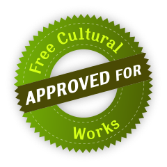

# Über lernOS

Das Verb "lernos" ist die Zukunftsform von "lernen" auf Esperanto (mi lernos = ich werde lernen, ni lernos = wir werden lernen). **lernOS** ist ein **Betriebssystem** für **Lebenslanges Lernen** und **Lernende Organisationen**. lernOS ist aber keine Software, sondern "Brainware". Es ist eine Art zu Denken und zu Handeln, um als Einzelperson, Team oder Organisation im 21. Jahrhundert erfolgreich zu sein. Das groß geschriebene "OS" im Namen unterstreicht die Bedeutung der Digitalisierung für unsere vernetzte Wissensgesellschaft.

Zu lernOS gibt es **drei grundlegende Leitfäden**, die den Ansatz auf **individueller Ebene** (lernOS für Dich, [Präsentation](https://cogneon.github.io/lernos-for-you)), auf **Ebene von Teams** (lernOS für Teams) und auf **Ebene von Organisationen** (lernOS für Organisationen) beschreiben. Zusätzlich gibt es die **lernOS Toolbox**, die oft genutzte Methoden und Werkzeuge erklärt (z.B. Podcast, Barcamp, Sketchnoting, Expert Debriefing). lernOS ist nicht auf der sprichwörtlichen grünen Wiese entstanden, sondern ist eine Zusammenstellung von bereits bestehenden und bewährten Methoden. Alle lernOS Leitfäden sind unter der **offenen Lizenz Creative Commons Attribution (CC BY)** auf der [lernOS Webseite](https://cogneon.de/lernos) verfügbar und können gerne an die eigenen Bedürfnisse angepasst werden.

Wenn du **weitere Fragen** bezüglich lernOS hast oder **Unterstützung von Gleichgesinnten** suchst, kannst du die Community-Plattform [CONNECT](https://community.cogneon.de) und den [lernOS CircleFinder](https://community.cogneon.de/c/lernos/lernos-circlefinder) nutzen oder mit [#lernOS](https://twitter.com/search?q=%23lernOS) auf Twitter schreiben. Beachte: Die Meisterschaft von lernOS ist eine Frage von Monaten oder Jahren, nicht Stunden oder Tagen. Also: **Keep Calm & Learn On!**

Dein [@locutusvonborg](https://www.linkedin.com/in/alexander-rose-loci/)

Aus Gründen der besseren Lesbarkeit wird im Folgenden auf die gleichzeitige Verwendung weiblicher und männlicher Sprachformen verzichtet und das generische Maskulinum verwendet. Sämtliche Personenbezeichnungen gelten gleichermaßen für beide Geschlechter.

## Lizenz

lernOS Leitfäden stehen unter der Lizenz [Creative Commons Namensnennung 4.0 International](https://creativecommons.org/licenses/by/4.0/deed.de) (CC BY 4.0):

**Du darfst:**

* **Teilen** - das Material in jedwedem Format oder Medium vervielfältigen und weiterverbreiten.
* **Bearbeiten** - das Material remixen, verändern und darauf aufbauen und zwar für beliebige Zwecke, sogar kommerziell.

**Unter folgenden Bedingungen:**

- **Namensnennung** - Du musst angemessene Urheber- und Rechteangaben machen, einen Link zur Lizenz beifügen und angeben, ob Änderungen vorgenommen wurden. Diese Angaben dürfen in jeder angemessenen Art und Weise gemacht werden, allerdings nicht so, dass der Eindruck entsteht, der Lizenzgeber unterstütze gerade Sie oder Ihre Nutzung besonders.
- **Keine weiteren Einschränkungen** - Du darst keine zusätzlichen Klauseln oder technische Verfahren einsetzen, die anderen rechtlich irgendetwas untersagen, was die Lizenz erlaubt.

